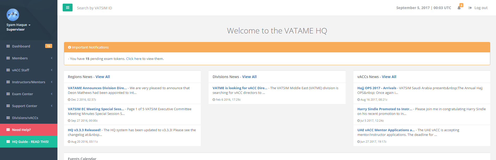
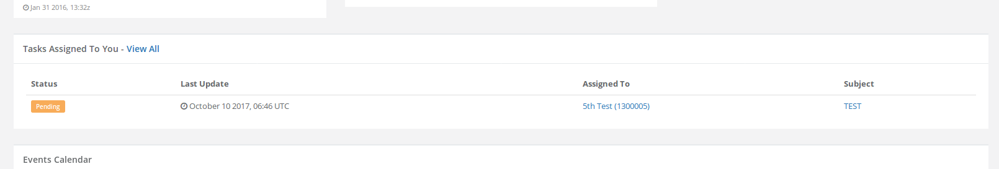
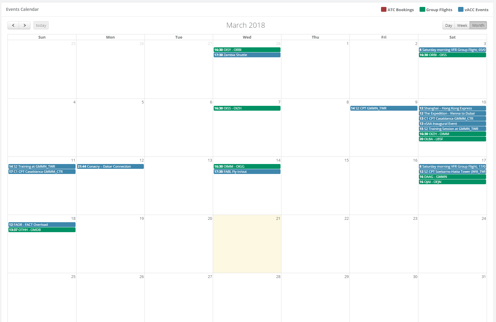

# Dashboard

## Notifications

Notifications that are relevant to you are listed at the top of the dashboard page in a yellow sub-panel at the top under the "Welcome" title.

## News

News from your respective region, division, and vACC for which you are a resident OR visitor controller will be displayed on this page.

## Tasks

If you are a staff and are assigned on a task in the HQ, they will be listed on this page \(limited to 5 tasks\). Clicking a task "Subject" will take you directly to the task or you can click "View All" on the table header to view all tasks you are part of. 

## Events Calendar

The calendar on the HQ system displays all kinds of events - vACC events, group flights, and ATC bookings. You can view this calendar any time by clicking the "Dashboard" link on the left side menu. The events are color coded to help identify their types.

You can click on an event in the calendar to view the event page for that event. On the event page, there may additional options.

