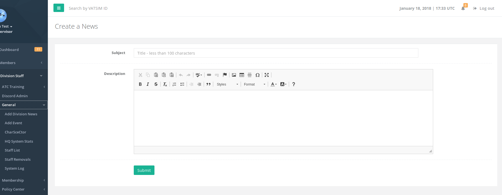
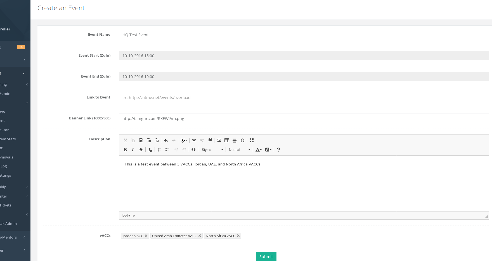
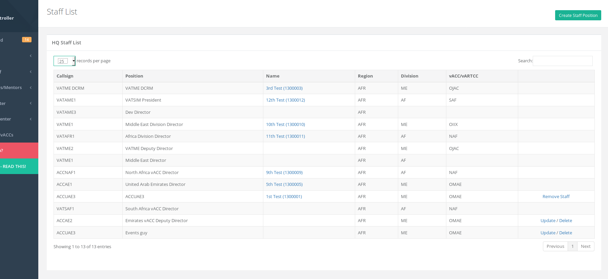

# General

## Add Division News

This page allows division staff to add a division news item which can be viewed by all members in their division on the HQ home page after logging in.

## Add Event

Any division staff can add an event. This should normally be done by the vACC events/marketing team after coordination with their staff and/or members.

The **Link to Event** is an external link to the event page that you may have. This is optional as there is also a public HQ event link that will be given for members to view the event.

The **Banner Link** should be a direct link to the image of the banner and sized as mentioned on the form \(width x height\).

The **vACCs** should be added if there are multiple vACCs participating in the event. For example, if UAE vACC is creating the event and the participating vACCs are Jordan, UAE, and North Africa vACCs, then the **vACCs** section of the form should only contain "Jordan" and "North Africa". \(UAE will be automatically added\). **If multiple vACCs are participating, only ONE of the vACCs needs to add the event**.

Below the form it will lists the events that have been added and events can be deleted from there.

## CharSceCtor

Any division staff can add CharSceCtor \(Charts, Sceneries, Sector Files, and Miscellaneous\). These should be direct links to the relevant documents/files. This will appear on the HQ vACC page as well as any websites that use the CharSceCtor API methods. **As a division staff, you can only add items for those vACCs that are OPEN vACCs**.

## HQ System Stats

This page lists HQ stats viewable by any staff member.

## Staff List

This page is a link to the HQ staff page listing all the staff members in the HQ system. If you are the vACC Director, then for staff in your vACC you will be able to Create/Delete/Remove/Update the staff.

Create a new staff position by clicking the top right green "Create Staff Position" button.

Update will allow you to update the position including adding a member to that staff. The new staff member will receive an email automatically once they have been appointed.

Remove Staff will be available once a member is appointed. If removing a staff member from your vACC, it will ask to provide a reason for the removal. The staff member will automatically receive an email once they have been removed.

Delete is available if the staff role is not assigned to any member and can be deleted. **Only the division director can make modifications to the staff list for their relevant division.**

## Staff Removals

Staff that have been removed in your division will be listed here including their reasons for removal and when they were removed. 

## System Log

The HQ system log lists all the actions that have been performed on the system. This is useful for audit purposes and to see when a certain action was done. Any division staff can view the system log and the data is shown for their division only.

