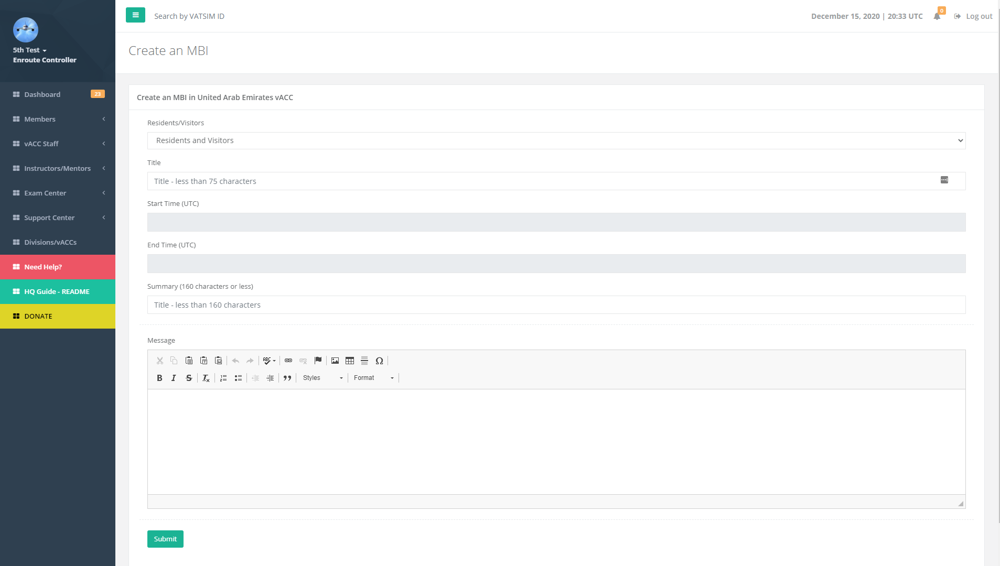
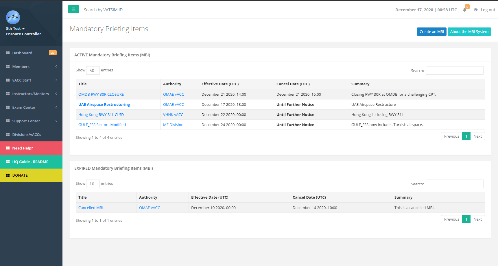
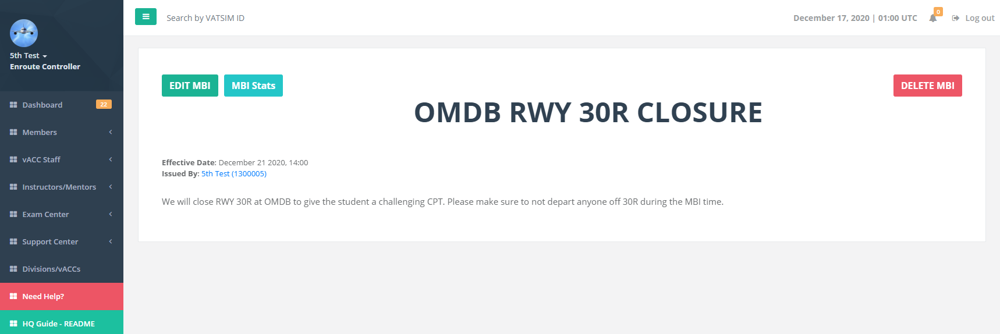
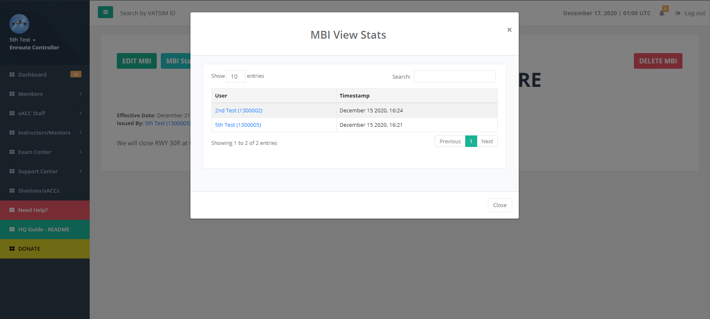

# MBI System

The MBI can be created by a division or vACC staff. A division staff can only create MBIs for their entire division. A vACC staff can create an MBI for their vACC only. The MBI can be restricted to resident or visitor members. The MBI must have a start time but end time is optional as some can be permanent changes.

Once an MBI is created, the necessary members can view it on the MBI list. This MBI will be shown until the End Date is met or the MBI is cancelled \(deleted\).

An MBI can be deleted by the staff team who posted it by visiting the MBI page and clicking the top right DELETE button.

The staff team can additionally view who has viewed this MBI by clicking the MBI stats on the top left.

