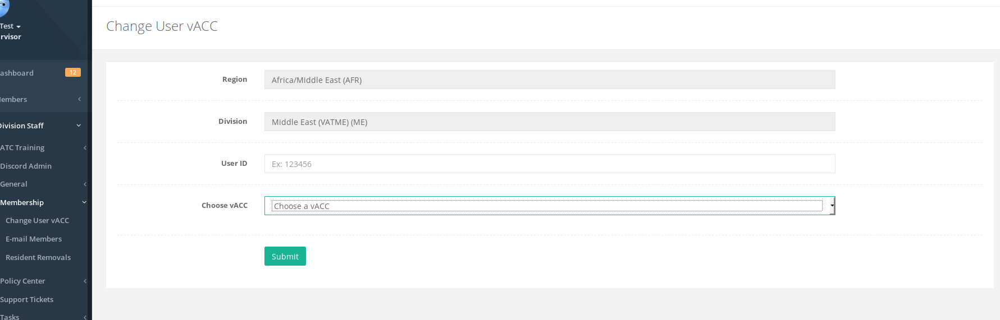
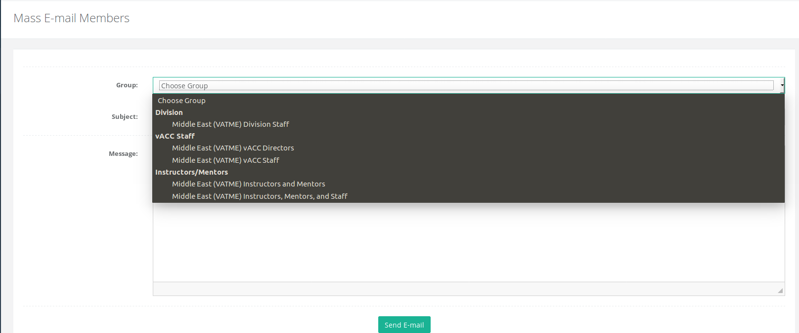

# Membership

## Change User vACC

This page allows the division director, deputy, or the division membership director to change a user's vACC. In some cases, it may be necessary or requested by the member and this page allows the change to occur.

Once submitted, the member will be notified that they have been moved and the new vACC staff will receive an email that the member has been moved to their vACC.

## E-mail Members

This page allows the division staff to send a mass email to certain staff groups under their division. Below screenshot shows the different options that are available to a division.

## Resident Removals

In very rare cases, vACCs remove a resident member from their roster due to a variety of issues \(technical or otherwise\). This page allows you to view any resident removals done by vACC staff in your region.

