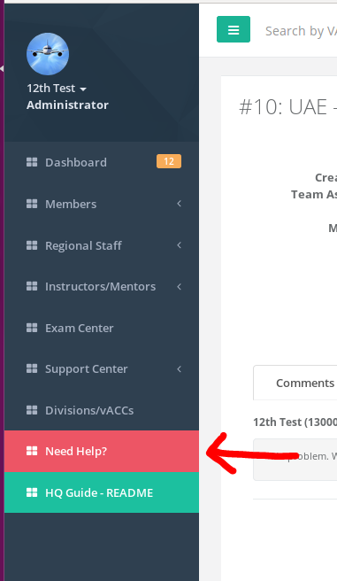
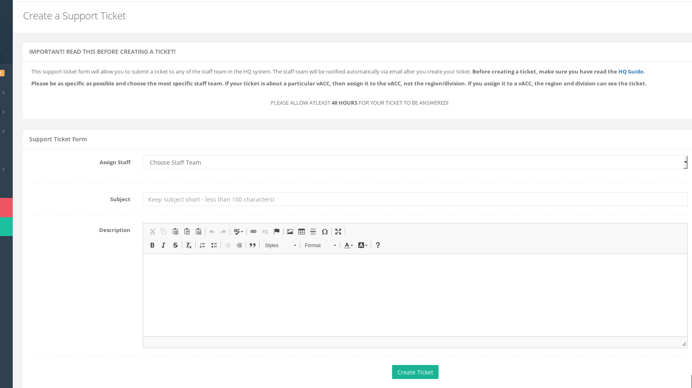
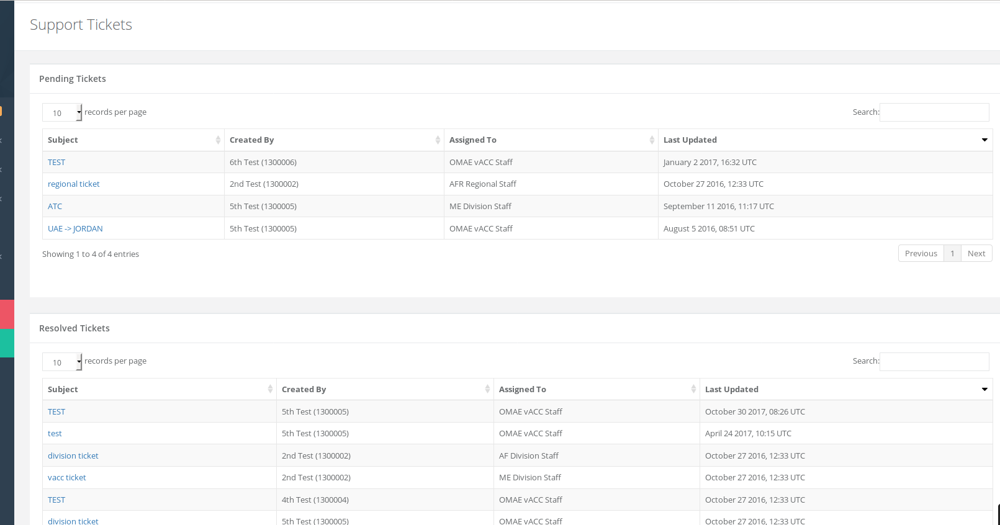
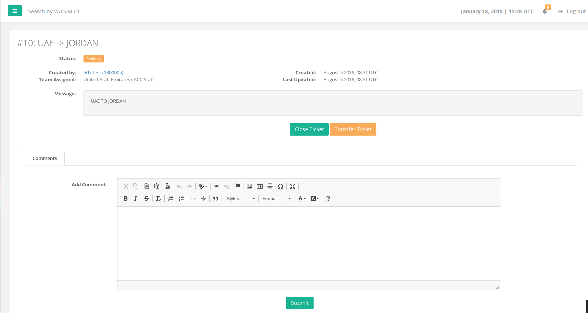
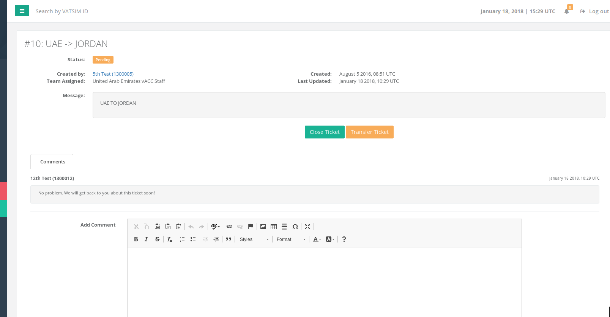
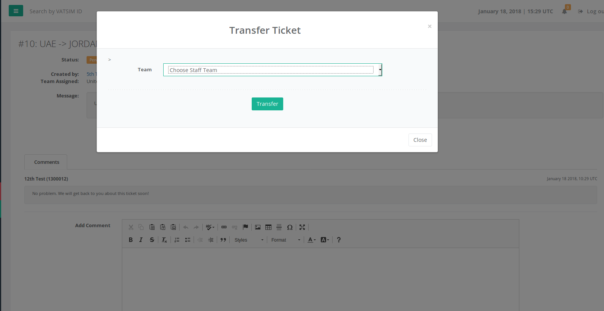
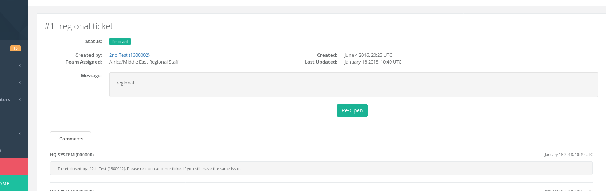

# Support Tickets

## About Support Tickets

The HQ support ticket system allows VATSIM members to request assistance by contacting their area staff team.

The support system allows members to submit tickets for any vACC/division/region that is part of the HQ system.

Members can create a ticket by clicking the red "Need Help?" button on the menu and will be taken to the support form to fill out.

 **Menu link for support system**

 **Support Ticket Form**

## View Support Tickets

The staff teams each have a "Support Tickets" option under their staff menu \(ex: under vACC Staff &gt; Support Tickets\). This page will list all support tickets that have been assigned to your team.

Any member of your team can view the ticket as well as staff that are above you. This means that if a ticket is assigned to the vACC staff team, the division and region staff teams for that vACC can also view and comment on the ticket! It is a "top-down" approach.

**A vACC staff member** - will only see tickets for their vACC  
 **A division staff member** - will see tickets assigned to their division staff and all vACCs under their division.  
 **A regional staff member** - will see tickets assigned to their region staff and all tickets assigned to the vACCs/divisions under their region.

### Commenting

Staff members who are able to view the support ticket can leave a comment and the member who submitted the ticket will receive a notification that there is a new comment on their ticket.

### Transferring a ticket

In some cases a ticket needs to be re-assigned by the staff team as it is not relevant to them. For example, a ticket requesting a transfer from one region to another should be assigned to the regional staff team. If it is assigned to the vACC staff team, then the vACC staff have the ability to "transfer" the ticket up.

### Closing a ticket

Once a ticket is deemed resolved, the member who created the ticket or the staff team that is assigned to the ticket can click the "Close Ticket" button on the ticket page. The member that created the ticket will receive an email notification about the closing.

Once a ticket is closed, the ticket can be re-opened **within 7 days** if the issue re-occurs and another ticket does not need to be opened for the same issue.

