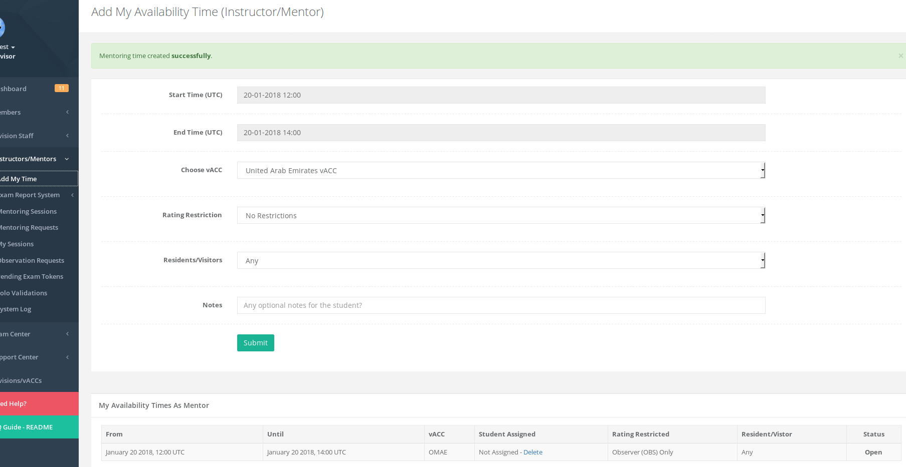

# Add My Time

This page allows a mentor/instructor to add their own availability times for students to pick up. Once submitted, members in their vACC will see the availability on the "Request ATC Training" page.

This feature must be enabled by your vACC director/deputy and in addition they can restrict the rating to OBS-only. This means you can submit your times and only members rated as OBS \(Observer\) can pick up your request. This give priority to OBS-rated members and the other ratings you can pick up their request as necessary.

You can also restrict the mentoring session to Resident/Visitors in your vACC and add any additional notes for the member to see.

To delete a request, you can delete from the table below the form.

