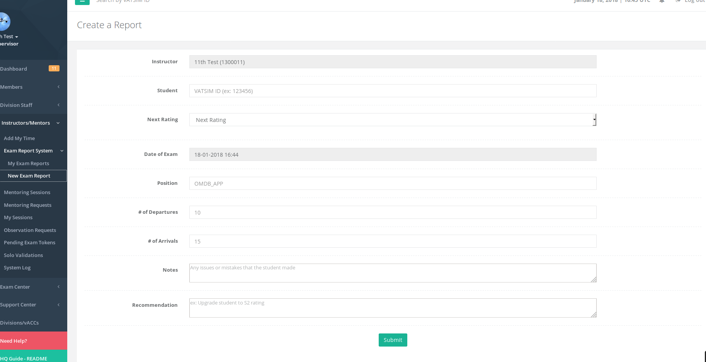

# Exam Report System

The exam report system allows instructors to submit reports once they have completed a Controller Practical Test \(CPT\) or otherwise known as an "over the shoulder" \(OTS\) exam. This report allows the instructor to note down how the student's CPT went and whether they recommend the student for an upgrade or further practice.

For certain divisions in the HQ system who are participating in the CERT-Access, the exam report system can be used to upgrade a student on the VATSIM CERT database. Once the report is submitted, the student will be upgraded automatically to the next rating specified on the report. An email notification is sent to all the vACC staff of the student, the division staff, and the regional staff to review the report.

**Note:** Only instructor rated members in the vACC will be able to submit exam reports. The region and division director/deputy can also submit exam reports.

