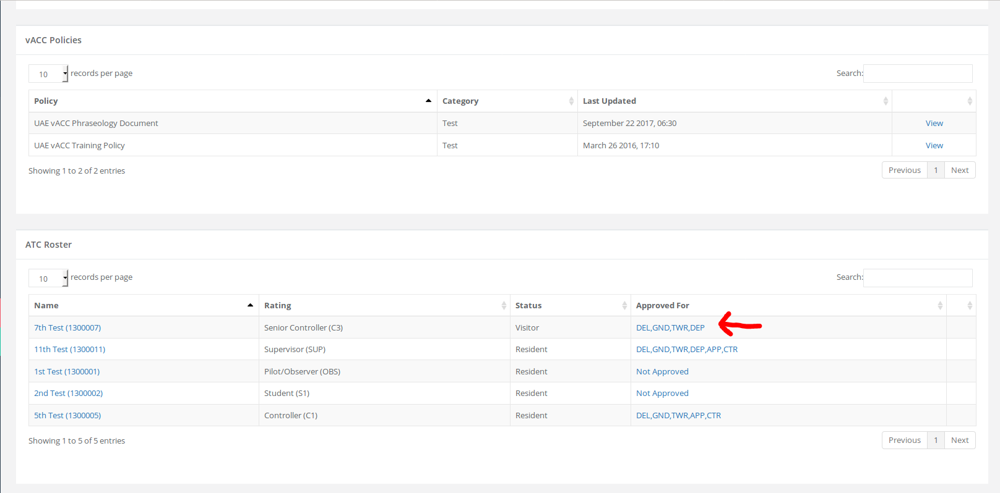

# Introduction

## Menu

On the left side menu, there is a dropdown menu for **Instructors/Mentors** which shows you all the functions that are available to you. Some of the functions are explained below.

## Assigning Exams

If you are an instructor or mentor and need to assign an exam, first go to the student's profile by searching their VATSIM ID at the top search bar on the HQ. On the student's profile page scroll down to the section **Exams** and use the dropdown to select the desired exam. Once the student has finished taking an exam all instructors/mentors in the vACC will be notified via email. You will also be able to come to the student's profile page to view their exams and results.

**Instructors and mentors can only assign exams for members who are in their vACC.**

## Modifying Approvals

As a mentor/instructor you are able to modify a member's approvals and sign offs if that member is part of your vACC. To do this, go to your vACC page by clicking on the menu "Divisions/vACCs" and then choose your vACC on that page. 

On the vACC page, scroll down to the "ATC Roster" section. Under the column "Approved For", click on the relevant member you would like to modify. 

Finally, on this page you can change the member's approvals and sign offs. If your vACC has not enabled the sign off feature, you will only be able to change the approvals. Once you submit the new approvals, the member will receive an email notification about the change. 

## Mentoring

### Pick a Mentoring Session

To pick up a student request go to the **Mentoring Requests** item under this menu. This page will list all the available students requests. Once a student request has been accepted the student will be notified via email and on the HQ. Instructor/mentors will be copied into the email, this way the student and instructor/mentor can communicate with each other on e-mail as well if necessary.

### Suggest Time

Some requests on the **Mentoring Requests** page may have an option for "Suggest Times". These are mentoring requests that have expired and the member has not put new availability times yet. 

As a mentor, you can suggest a time that you are available for the student. 

Once the time is suggested, the student will receive a notification and they will then be able to view this page and ACCEPT/REJECT the suggested time. If the student accepts, a mentoring session will automatically be created. If it is rejected, the mentor will be notified and the student will need to wait until a mentor suggests a new time. 

**When the student adds new availability times on the HQ, their suggested times will be removed**.

### Close Mentoring Session

Once the instructor/mentor has finished a mentoring session, the session should be closed. By closing the session, no further comments can be posted in the session. You can close the session by going to the **My Sessions** section, then choosing your **pending** mentoring session by clicking **"View"**. Here you can click **"Close Session"** to close your mentoring session.

