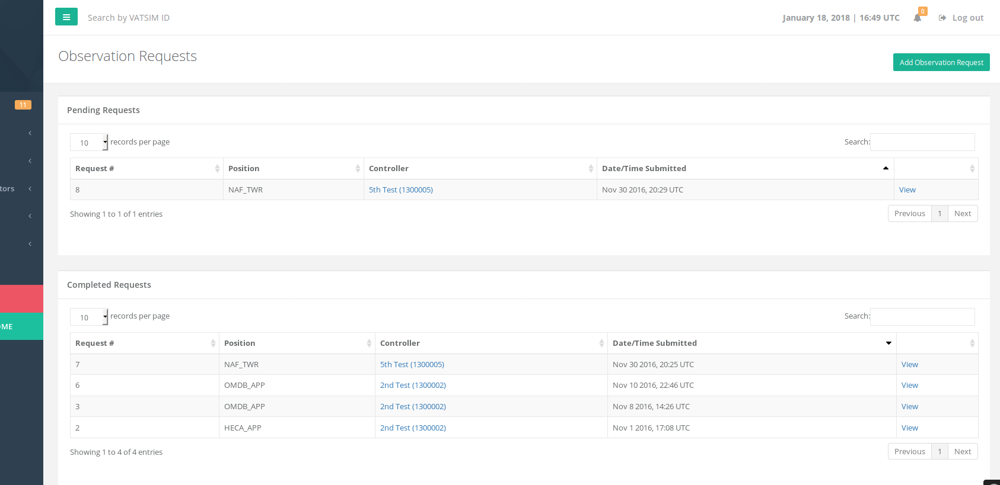

# Observation Requests

Observation requests are video recordings that members in your vACC have submitted for review. These can be used to see how a member is progressing and where they need improvements on.

This feature must be enabled by your vACC director/deputy from the vACC settings page.

