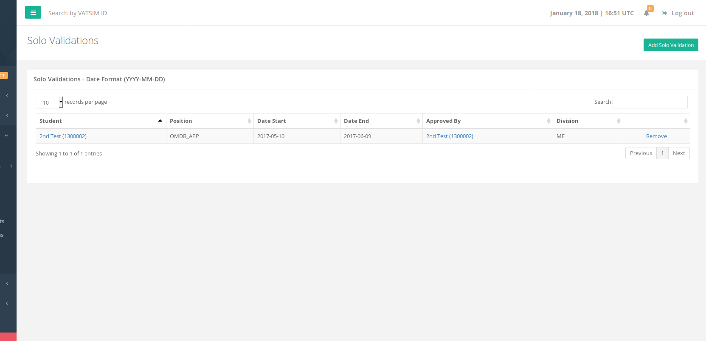

# Solo Validations

This page shows all the solo validations in the HQ system that have been submitted by instructors. You can remove a solo validation that is part of your vACC on this page or add a new solo validation by clicking the green "Add Solo Validation" button on the top right of the page.

