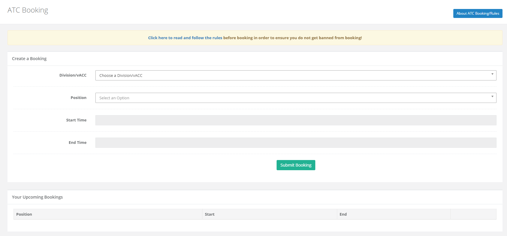
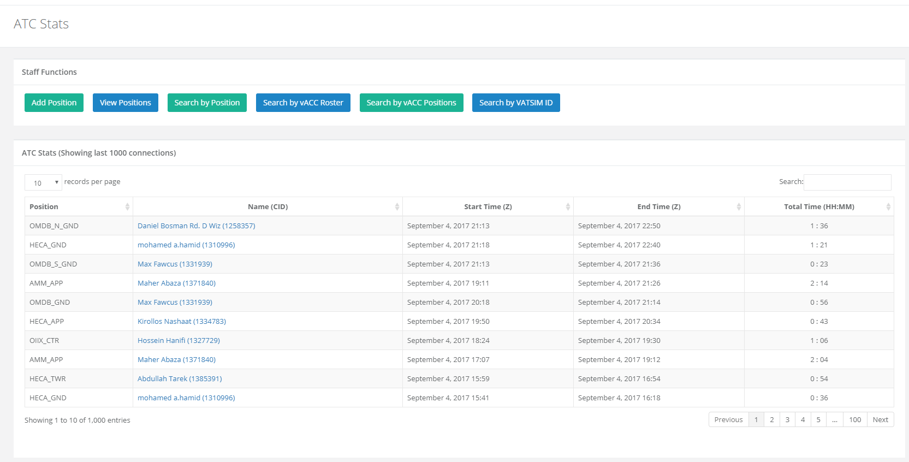
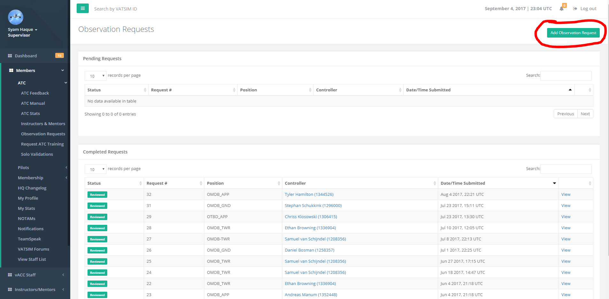
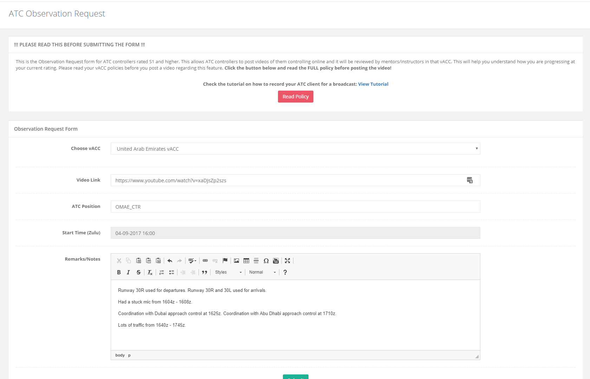
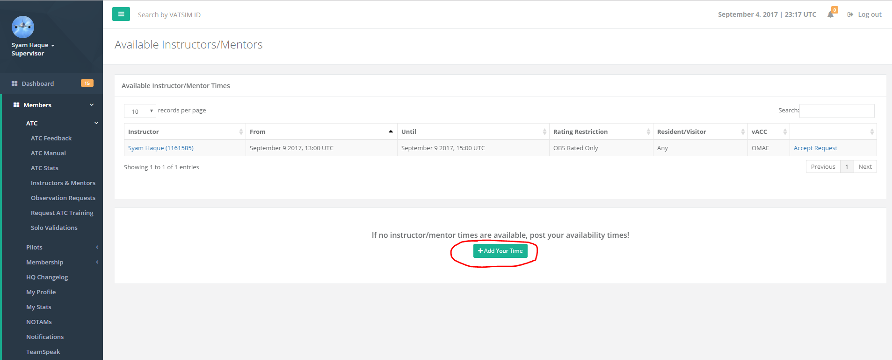
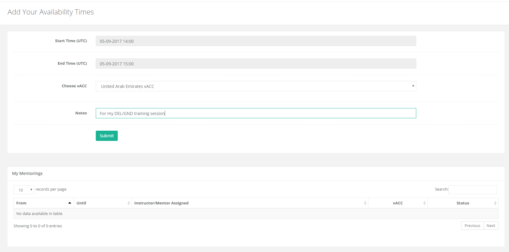

# ATC

## ATC Booking

ATC booking allows resident and visiting members of vACCs in the HQ system to book positions. The bookings are submitted to the [vRoute system](http://www.vroute.net/) as well.

The "position" section on this form is taken from the entries that the vACC staff enter on the [ATC Stats page](../vacc-staff/atc-training.md). If you do not see a certain position on this list that should be there, please contact the vACC staff and ask them to add the position so that it can be booked.

**Please be sure to read the ATC booking rules on the page prior to submitting your request.** 

## ATC Feedback

The ATC feedback allows members on the VATSIM network to leave feedback for controllers. You can leave feedback to any visitor or resident controller who is in the HQ system.

First, enter their VATSIM ID \(ex: 1161585\) and then click "Next".

On the next page, ensure the name is correct and fill out the remainder of the form and click "Submit". Upon submission, the vACC staff at their vACC will receive a notification that a new feedback was submitted.

## ATC Stats

The stats page shows a list of ATC positions that have been online. If you are a staff member, there will be additional functions above the table. These functions are explained in the "vACC Staff" section of this manual.

**Only positions that have been added by the vACC staff will be recorded by HQ.**

## Instructors & Mentors

This page shows all the instructors and mentors in the HQ system for all regions. You can filter the table using the search box on the top right.

## Observation Requests

This page will list any observation requests that you have submitted. Observation request is a separate module and is enabled or disabled by the vACC staff.

The "Observation Request" is an optional training method that is used by some vACCs. This allows an ATC student to post videos of themselves controlling online and the vACC training staff will review the video. The vACC training staff will leave feedback for the video to help the student understand how they are doing at their current rating before moving to the next rating.

There are two primary ways of recording and uploading your video: YouTube or Twitch. **It is highly recommended to use YouTube, because Twitch only keeps your videos for 14 days and then they are deleted**!

There are 2 video tutorials to help you understand how to set up the recording software and link it to YouTube/Twitch. Please review the following videos...

YouTube method: [https://www.youtube.com/watch?v=xaDJsZp2szs](https://www.youtube.com/watch?v=xaDJsZp2szs) Twitch method: [https://www.youtube.com/watch?v=PrD3vqe\_DXQ](https://www.youtube.com/watch?v=PrD3vqe_DXQ)

**Please review your vACC training policies before using this feature to be sure how they use it. Some vACCs may not use this feature, so it's best to make sure or ask the vACC staff. In order to submit an observation request for a vACC, the vACC staff must have this feature enabled.**

### Create an Observation Request

You can create an observation request if you have a rating of S1 or higher. Go to the **Observation Requests** page and on the top right click the green button "Add Observation Request".

Fill in the observation request form as outlined - choose the vACC for which the position belongs to, the direct video link, the position you were controlling, and the time you started recording \(in ZULU\). All times should be in ZULU!

The remarks/notes part is optional however it is highly recommended to add important details of your session here. An example is shown below.

## Request ATC Training

This page allows members to request ATC training from mentors. On this page, the top table will show available mentors who have posted their availability times. These are usually preferred as it guarantees the mentor will be available. If no mentors are listed in the table then the next option is to post your own availability times by clicking the green button on the bottom section "Add Your Time".

It is recommended to add multiple available times that you have for at least 1 - 2 weeks. This allows a higher chance of finding an available mentor. **As VATSIM is a volunteer network, members should be mindful that mentors are volunteers and donate their time to teach members ATC.**

**You should always review your vACC ATC training policies/procedures before requesting training.** Some vACCs may require taking a theory exam or reading through some material before requesting a training session.

## Solo Validations

This page lists all solo validations that have been added by instructors for their respective vACC members. Solo validations are explained in the [VATSIM Global Rating Policy](https://www.vatsim.net/documents/global-ratings-policy).

