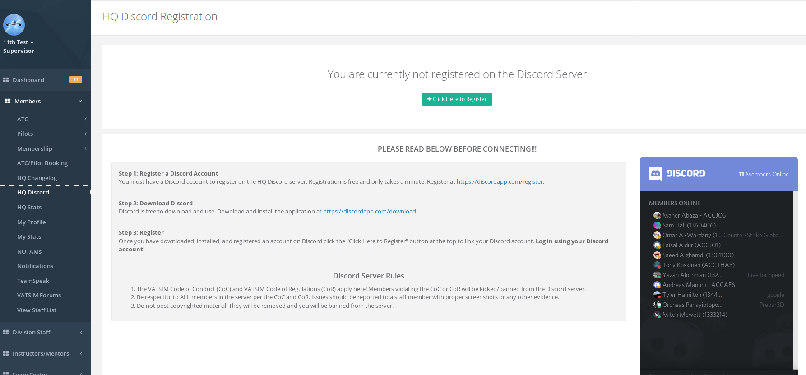

# HQ Discord

The HQ Discord is a discord server on the HQ system that allows any resident/visitor member that is in the HQ system to connect to the voice server. This can be useful for coordination and meeting fellow members.

**The HQ Discord server follows the VATSIM Code of Conduct and Code of Regulations. ALL MEMBERS must be respectful to one another as they would on the VATSIM network. Any member can be banned on the server via a staff member for violations of the CoC or CoR and further DCRM actions can be taken against the member as necessary!**

You must follow the instructions on the page to download and register your Discord account with the HQ system in order to connect to the voice server.

