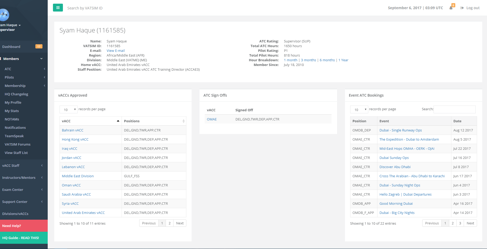
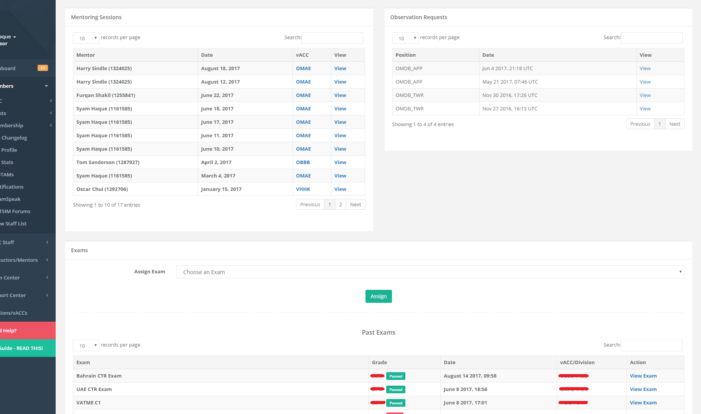

# My Profile

This page shows your profile page on the HQ system. It includes public information from VATSIM, such as your name, the region/division you belong to, and any staff position you hold.

The e-mail is ONLY visible to you and region/division/vACC staff members who you are a resident or visitor controller of.

If you are rated S1 or higher, you will see additional panels below for areas where you are approved, ATC sign offs achieved and confirmed event ATC bookings.

For staff members, this page will include additional panels on the bottom which list mentoring sessions, observation requests, and ability to assign the member theoretical exams.

