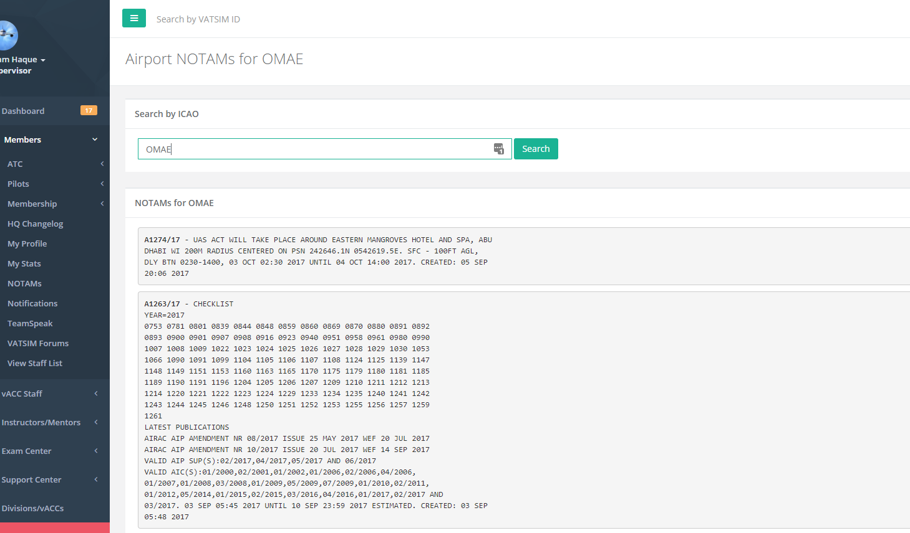
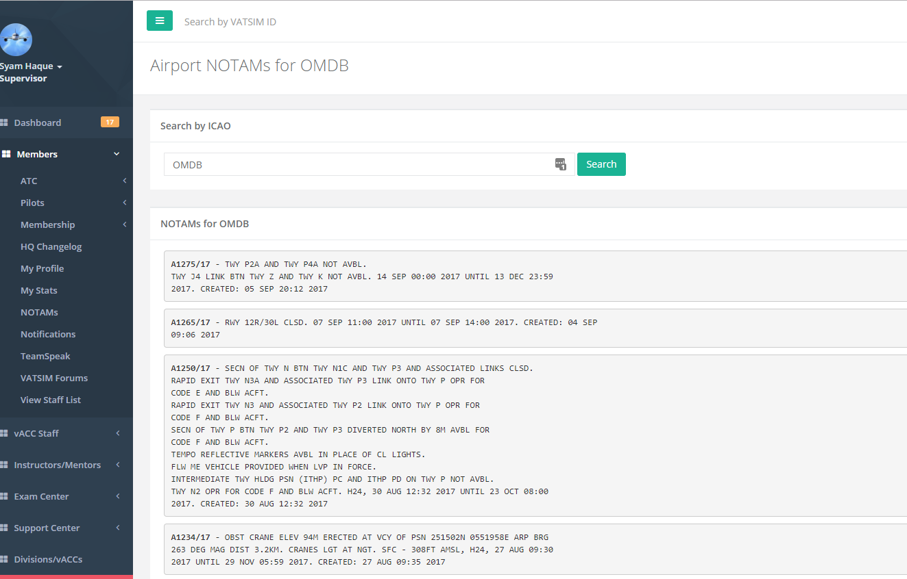
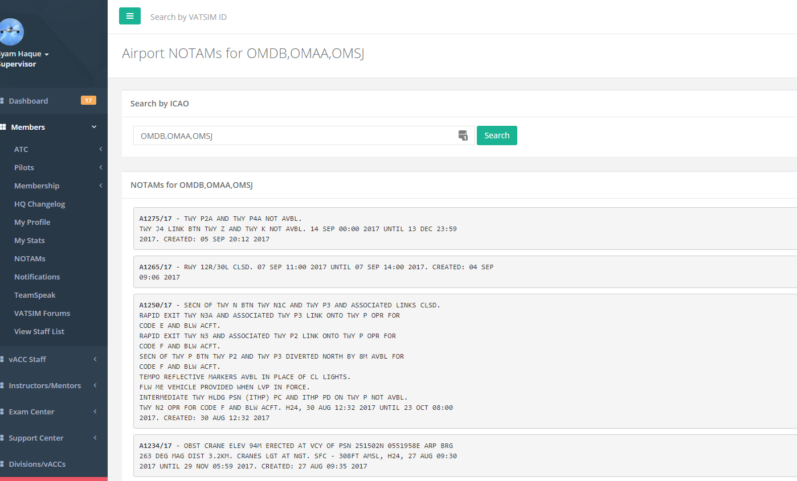

# NOTAMs

The NOTAMs page is available to all members that are logged in to the HQ system. It allows you to search for NOTAMs for any airport which can be used by you as an ATC or pilot.

Airports or airspace abbreviations can be entered to receive the relevant NOTAM for that area. Multiple entries can be entered, separated by commas.

Examples are given below.

 **Searching for NOTAMs in an airspace**

  
  **Searching for an airport NOTAM**

  
  **Searching for multiple airports, separated by commas**

