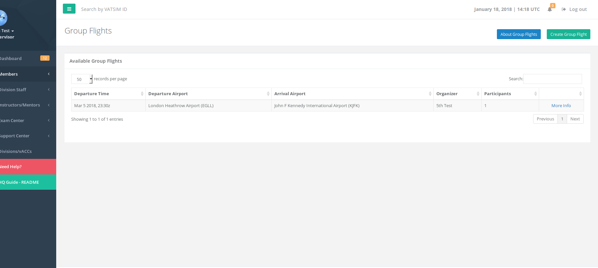
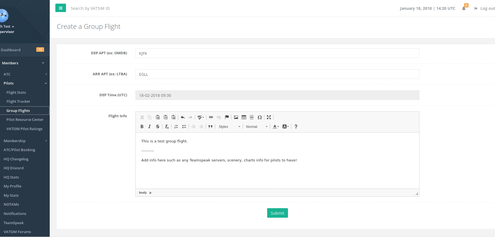
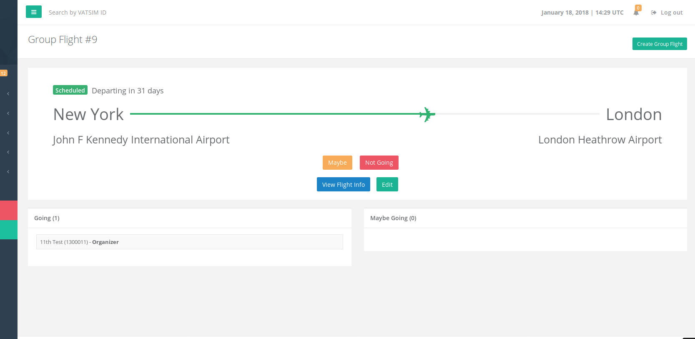

# Pilots

## Flight Stats

This is a simple link to the [http://www.vataware.com](http://www.vataware.com) website to view your stats.

## Flight Tracker

This is a simple link to the [http://www.vattastic.com](http://www.vattastic.com) website to view the map of current flights on the VATSIM network.

## Group Flights

This is an HQ module to create group flights and invite your fellow VATSIM members to join your flight. This function is open to ALL VATSIM members who are able to log into the HQ system \(any member who is not suspended\). **In order to create a group flight, you must have at least 3 hours of flight time on the network.**

### Creating a Group Flight

On the group flight page, click the green "Create Group Flight" button on the top right of the page. Next fill in the info on the form...

* Departure/Arrival airports should be in ICAO format
* Departure time should be in UTC
* Flight Info should include any necessary information for the other members \(teamspeak info, charts, sceneries, etc\). **Do not post copyrighted or illegal links as that will result in a ban from creating further group flights.**

Once the group flight is created, you will be taken to the group flight page where members can decide on joining. The blue "View Flight Info" button will show the Flight Info that was submitted on the create page.

The organizer can EDIT the flight info by clicking the green "Edit" button. Members can choose between options such as "Going", "Maybe", and "Not Going" if they have chosen one of the other options.

## Pilot Resource Center

This is a link to the VATSIM PRC page at [https://www.vatsim.net/pilot-resource-centre](https://www.vatsim.net/pilot-resource-centre)

## VATSIM Pilot Ratings

This is a link to the VATSIM Pilot Academy page at [https://academy.vatsim.net/](https://academy.vatsim.net/)

