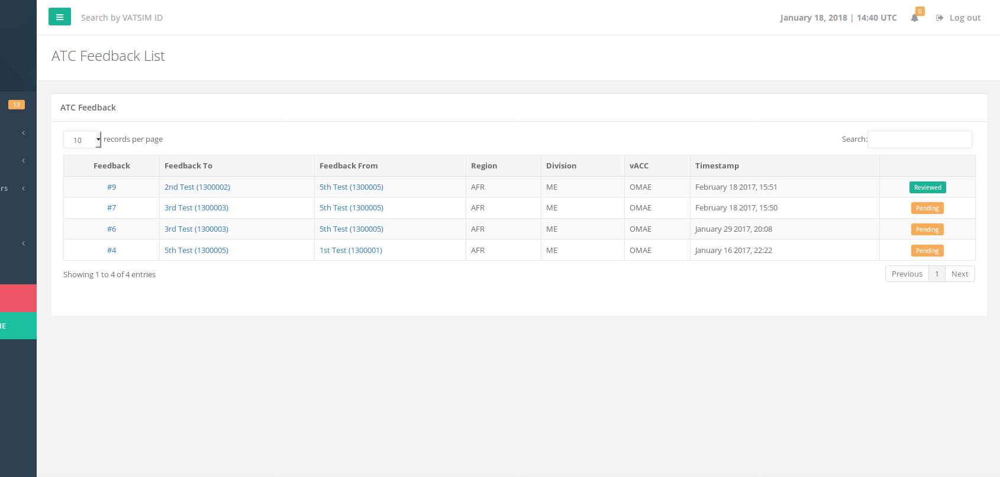
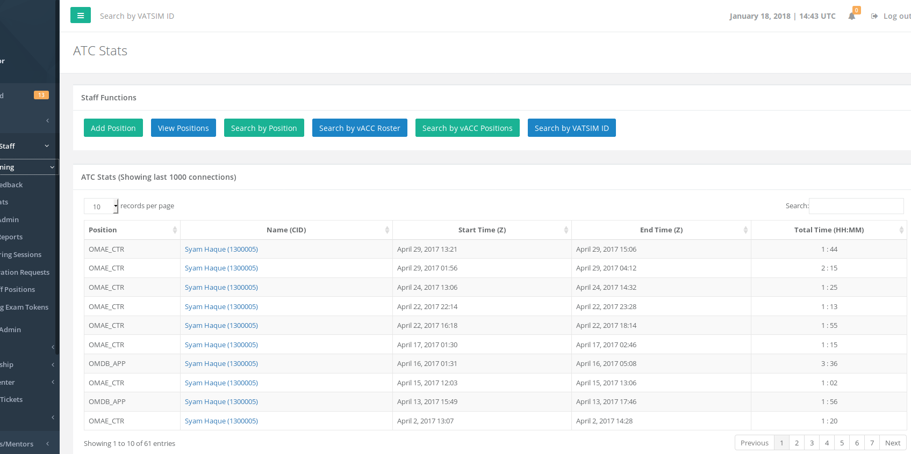
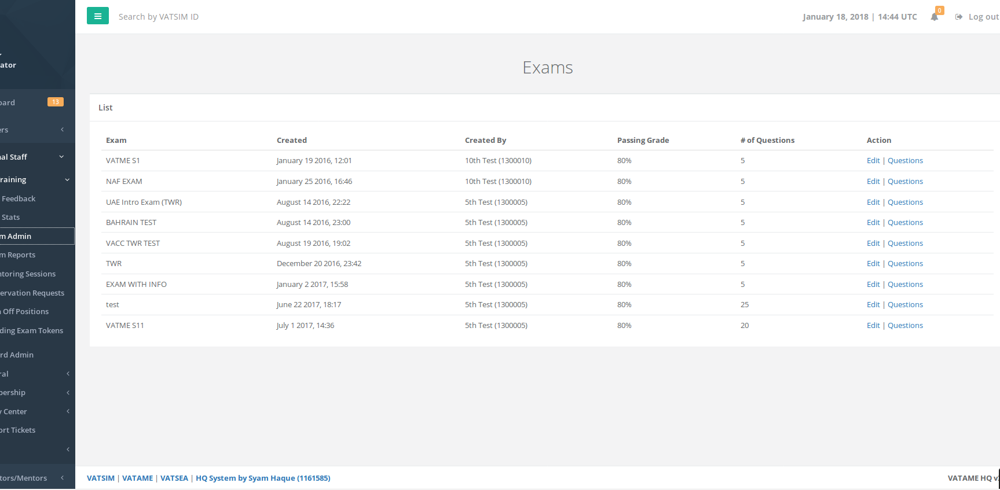
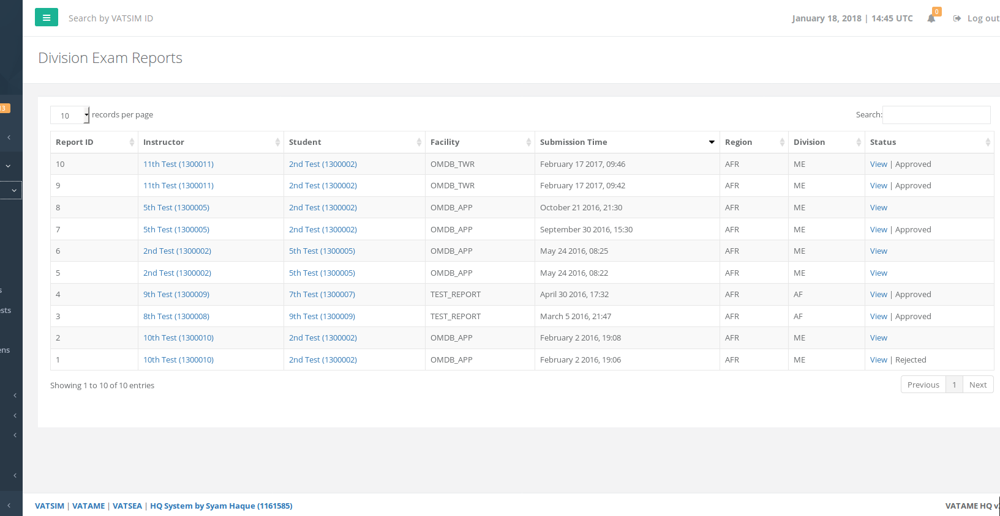
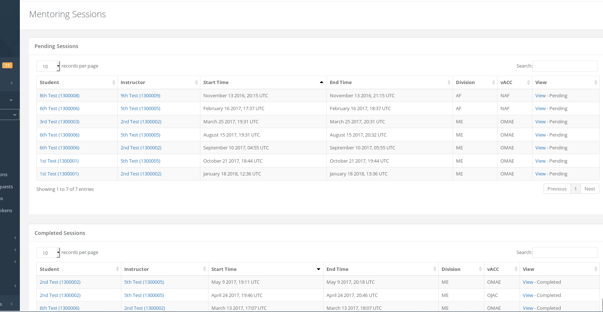

# ATC Training

## ATC Feedback

This page allows you to view all ATC feedback that have been suggested in your region. Clicking on the ID \# on the left most column will allow you to view the feedback. On the right most column will allow you to see if the relevant vACC has acknowledged the feedback or not.

## ATC Stats page

This page allows you to view ATC stats and query certain functions to see specific information about ATC activity.

## Exam Admin

View theoretical exams that have been created by vACCs and divisions under your region for auditing purposes.

## Exam Reports

These are CPT exam reports that have been submitted by instructors under your region. You can view the reports and check if the report has been "approved" \(student was upgraded\) or if the report was "rejected" \(student not upgraded\).

## Mentoring Sessions

At a glance view of pending and completed mentoring sessions under your region.

## Observation Requests

At a glance view of all observation requests submitted under your region. Observation requests are video links of students demonstrating their controlling on the network and allows mentors/instructors in their vACC to view the videos and critique them.

## Sign Off Positions

View of all the Sign Off Positions created under your region. This is created for "special positions" or for vACCs to "sign off" a student on a current position before proceeding to the next.

## Pending Exam Tokens

View of all the pending theoretical exam tokens under your region.

