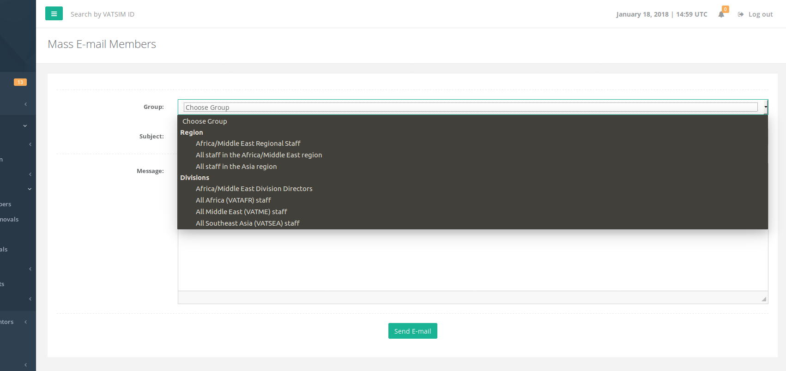
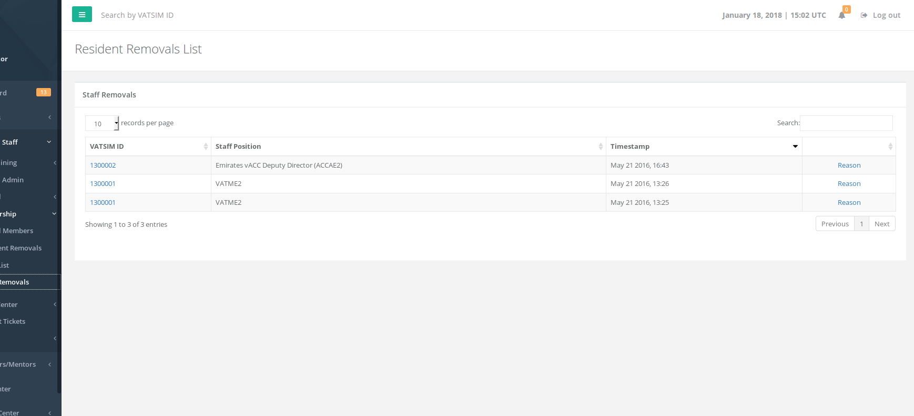

# Membership

## E-mail Members

This form allows you to send a mass email to certain staff groups under your region. Below screenshots show the groups that the REGION staff can e-mail. Please note that after clicking the SUBMIT button, the e-mail is sent after 5-10 minutes to not cause a strain on the system.

## Resident Removals

In very rare cases, vACCs remove a resident member from their roster due to a variety of issues \(technical or otherwise\). This page allows you to view any resident removals done by vACC staff in your region.

## Staff List

This page lists all the staff in the HQ system. For staff under your region, the regional director has the ability to REMOVE any staff member. The regional director is able to only appoint division directors who then are tasked with appointing staff below them.

## Staff Removals

Lists any staff removals that have happened under your region including the reason for removal as noted by the staff.

