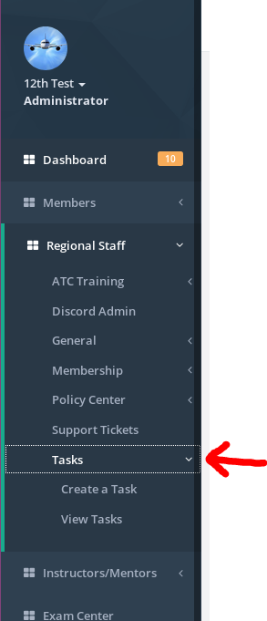
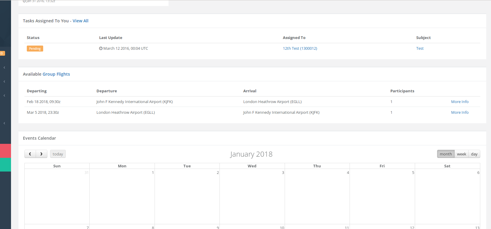
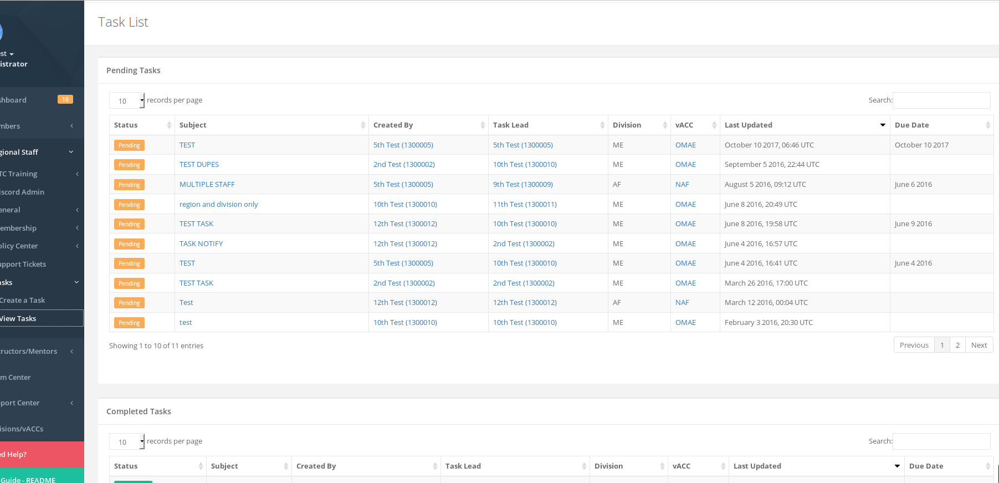
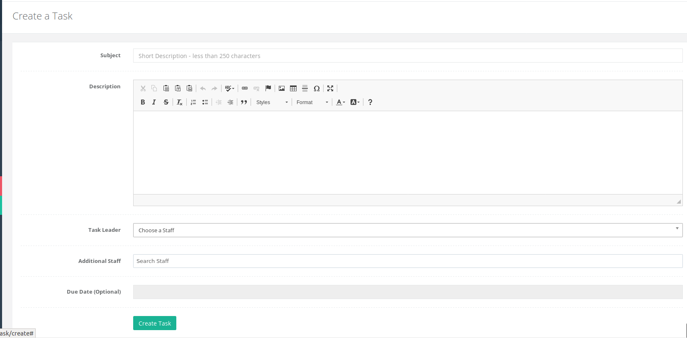
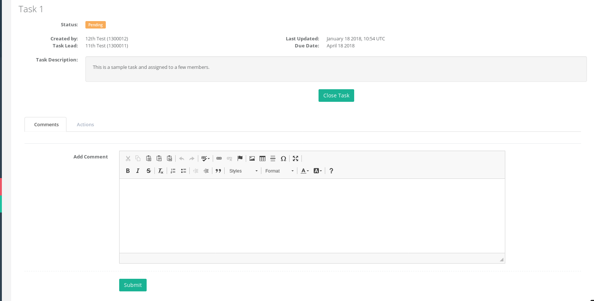
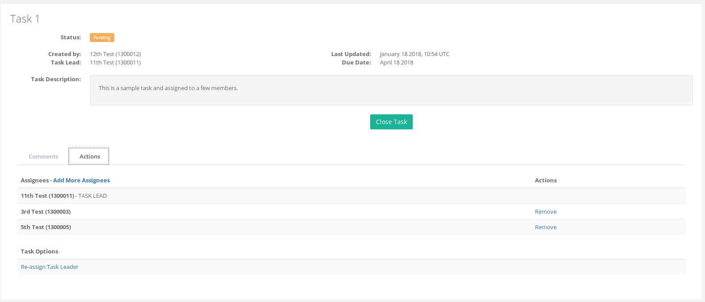

# Tasks

The tasks system in the HQ allows staff teams to coordinate and create tasks for one another. This allows the teams to understand what they are working on and/or have worked on. A task can be assigned to any staff member by any other staff member. A task can also be assigned to yourself in case of a reminder to get a certain action done.

Each staff menu has a "Tasks" sub-menu which allows you to "Create a Task" or "View Tasks".

On the homepage of the HQ system \(Dashboard page\), if you are assigned a task and you are the "task leader" in the task, you will see it on the dashboard page under a table for "Tasks Assigned To You".

## View Tasks

You can view tasks under your general staff role.

**A vACC staff** - can view all tasks they are a part of.  
 **A division staff** - can view all tasks they are a part of or if one of the members in the task in the task is part of their division.  
 **A regional staff** - can view all tasks they are a part of or if one of the members in the task in the task is part of their region.

## Creating a Task

To create a task, on the staff menu navigate to **STAFF MENU &gt; Tasks &gt; Create a Task** as shown in the first screenshot above.

The necessary information on the form should be filled out. A task leader must be assigned \(it can be assigned to yourself\). Any additional staff members can also be assigned on the form and an optional due date given. Once the task is created, all the staff members in that task will receive an email notification that they are part of the task and to review the task.

## Commenting on a Task

Any person part of the task can leave a comment such as a status update on the task. A notification is sent to the other members of the task about the comment.

## Actions on a Task

If the task is complete, the task leader or the member that created the task can close the task by clicking the green "Close Task" button on the top. An email notification is sent out to the task creator that the task is now complete.

If a task needs to modify members then the member that created the task or the task leader can add/remove additional staff. The task creator can re-assign the task leader as well on the "Actions" tab.

Any additional staff members that are added will receive an email notification similarly to creating a task.

## Staff Removals and Task

In case a staff is removed and they were part of the task, the relevant director of that member \(vACC director/division director, etc\) can re-assign the task or close the task.

