# ATC Training

## Add Mentor

This page allows you to add a mentor to your vACC. Only resident members with a controller rating of S1, S2, S3, C1, C3, SUP, or ADM can be added as a mentor. Members rated I1 or I3 cannot be added as a mentor and must be marked as an Instructor on your vACC roster page.

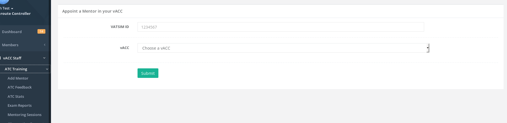

## ATC Feedback

View all the ATC feedback submissions in your vACC. Clicking a feedback ID on the left most column will take you to the feedback viewing page. Feedback can be marked as reviewed once a staff member has viewed it. Feedback can be marked as reviewed by any staff member in the vACC.

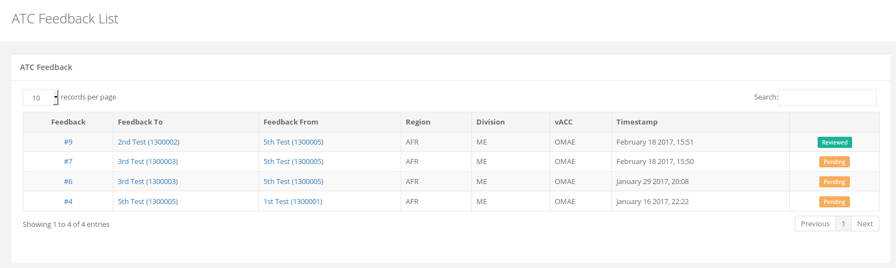

## ATC Stats

This page is similar to the ATC stats page shown in the Members menu, however, there are additional staff functions above the table for staff to query the data. The ATC stats data is kept up to 2 years in the HQ system after which any data older than 2 years is deleted. Data is recorded every 2 minutes from VATSIM and as such, some timings may be 2 minutes ahead or behind the actual VATSIM timing.

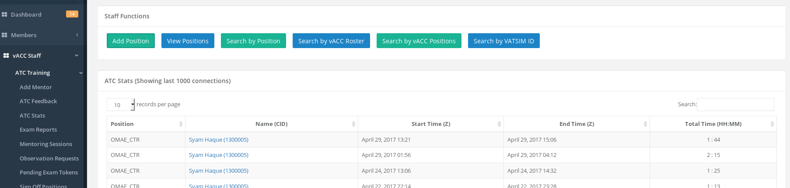

### Add position

The ATC stats only monitors positions that have been added by the vACC staff. The vACC staff should add all the ATC positions within their vACC only. Once the position has been added, it will be monitored immediately. ATC positions can only be added by the vACC director, vACC deputy director or vACC ATC training director.

Positions that are added here are also used in other parts of the system such as on the ATC Booking and ATC Feedback pages.

### View Positions

View ATC positions that have been added in the HQ system, including by who added the position and their relevant division and vACC. You may also remove a position here that was added previously by your vACC staff.

### Search by Position

Search by a specific ATC position given a date range. Example: You can search for OMAA\_APP between Jan 01, 2016 - Jan 01, 2017.

### Search by vACC Roster

This function allows you to view all the time each of the members in the selected vACC controlled in that vACC. The positions are only counted for that vACC. For example, if the selection was Egypt vACC and date range Jan 01, 2015 - Jan 10, 2015 then it will get all the ATC members from Egypt vACC and check how long they controlled positions that are in Egypt vACC and total the times up.

In addition, once this function is submitted and the result is shown, on the bottom of the results table will be a form to send emails to controllers that you select on the table. The email function is only available if you choose your own vACC.

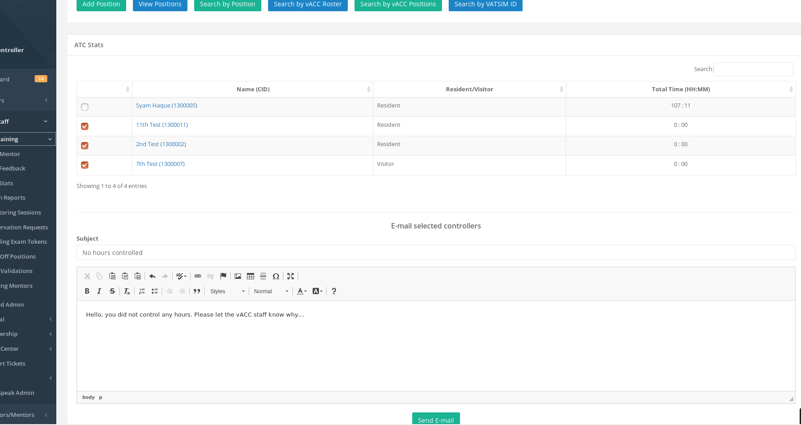

### Search by vACC Positions

This function will return the total times of each of the ATC positions and how long each position was online for during the date range given.

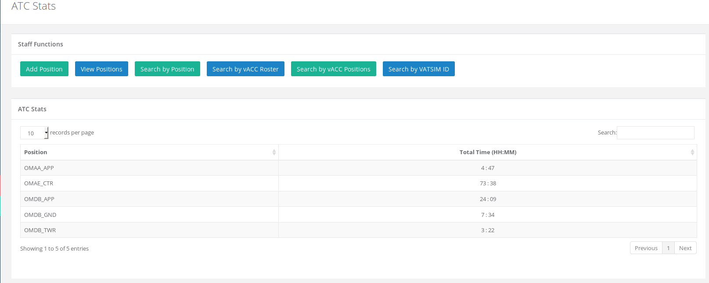

### Search by VATSIM ID

This function allows you to search all the positions controlled by the VATSIM ID that is submitted.

If the "Group Positions" is selected to **YES**, then it will return the total time the member controlled each position. Otherwise, it will return each position that was controlled separately.

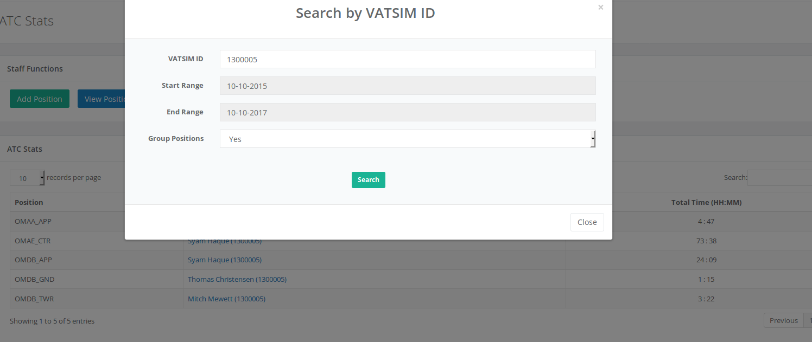

## Exam Reports

The exam reports shows all the CPT \(controller practical test\) reports that have been submitted by Instructors in your vACC. On the STATUS column, you can view the report and it will also note if the report has been approved by the division training staff or not.

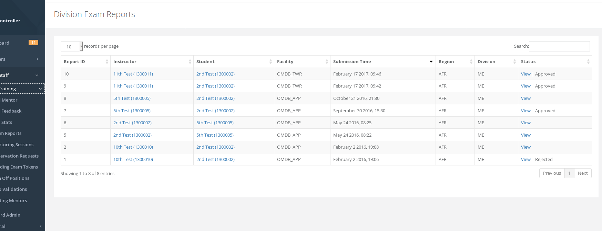

## Leave of Absence \(LOA\)

The LOA module allows vACC ATC training staff to add members on their LOA list to keep track of active and inactive members. Any resident or visiting member in your vACC can be added to the LOA roster. A maximum of 90 days is allowed each time from start date to end date. **This feature must be enabled by your vACC director/deputy on the vACC settings page.**

To create an LOA, click the green "Create LOA" button on the top right of the page. You can only add an LOA for a resident/visitor member in your vACC. 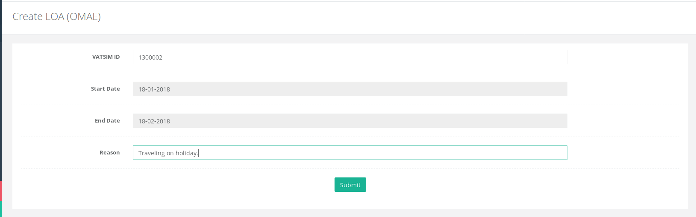

Once the member has been added to the LOA, they will receive an email notification about it. Their previous approvals and any sign offs will also be recorded and shown on the LOA main page. **The member will be un-approved on the roster once they are added to the LOA.** 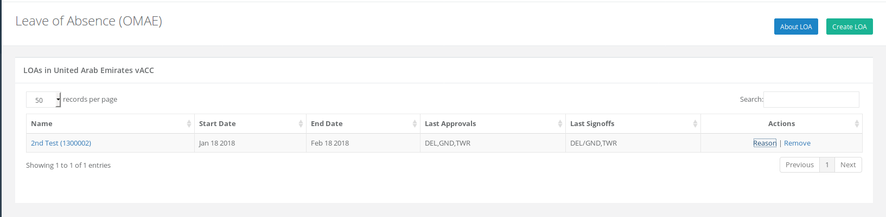

Once the member is removed from LOA, the HQ system will automatically set their previous approvals and sign offs again on their profile.

## Mentoring Sessions

View all the mentoring sessions that are pending or have been completed in your vACC. The top table shows all the mentoring sessions in PENDING status and the bottom table shows those sessions that have been CLOSED by the mentor/instructor.

The details of the mentoring session can be viewed by clicking the "View" link under the STATUS column. Only those sessions with both a "mentor" and "student" assigned will be viewable.

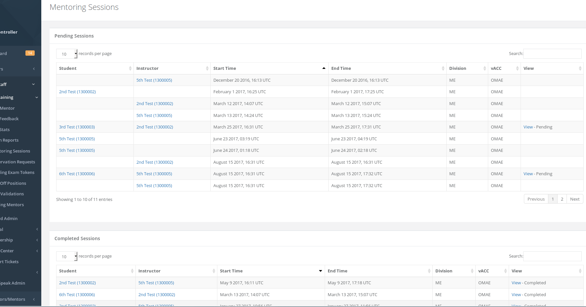

## Observation Requests

Observation requests that have been submitted by members in your vACC will be available here. Pending requests will be shown on the top table and those that are completed will be shown on the bottom table. Clicking "View" on the far right column will take you to the details page for the request.

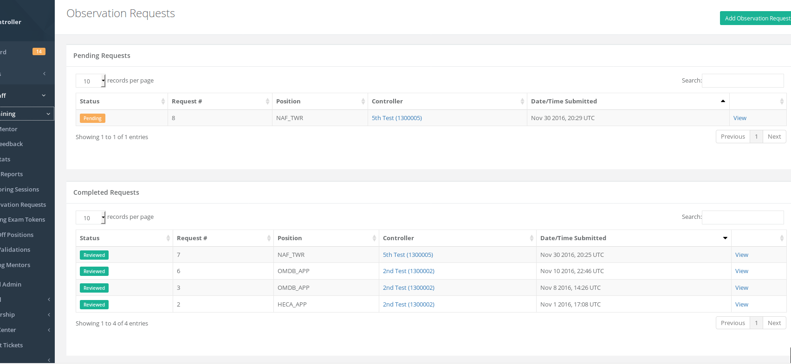

## Pending Exam Tokens

Any pending theory exam tokens in your vACC will be viewable here. If your vACC exams have a fixed "re-assign" time, then it will be shown on the top table. Typically the exams are re-assigned automatically by the HQ system however if any are missed \(which rarely happens\) they will be shown on this page with the "Re-assign?" column status as **YES**

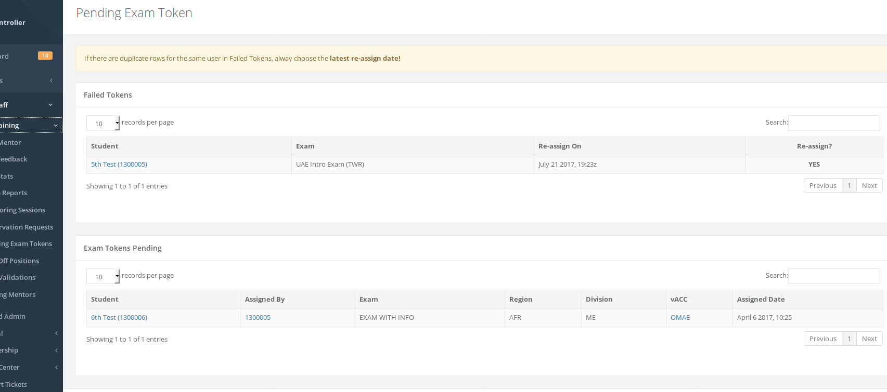

## Sign Off Positions

If your vACC ATC training uses the "sign off" method then the sign off positions can be added here. Sign off is typically used in some vACCs before a student progresses to the next. For example, if the vACC adds sign off for "DEL/GND" then a member who is currently a DEL/GND rated controller must demonstrate that they fully understand this position before moving to TWR \(Tower\).

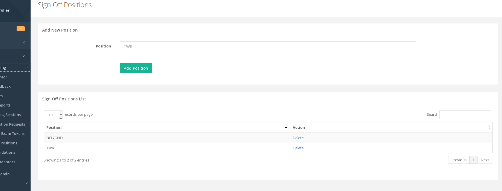

## Solo Validations

This page will show you all the solo validations that are current in your vACC. If you are an Instructor, then the top right part of the page will have a green "Add Solo Validation" button to add a member to the list from your vACC.

## Visiting Mentors

For vACCs in the HQ system, it is possible to "share" mentors and instructors between vACCs in times of need. If a vACC is short on mentors/instructors and needs assistance, it can request from another vACC in the HQ for a specific mentor/instructor. The member being added as a visiting mentor must already be a mentor in their current resident vACC.

Using the form at the top, enter the VATSIM ID **of the member you want to add**. For vACC, choose **your vACC**. This is equal to saying "I want to add 1300010 to United Arab Emirates vACC". Once the form is submitted, the vACC staff that the member is a resident in will receive an email informing them of the request.

The table on the left side shows other vACCs that have requested your mentors. You must Approve/Reject the request in order for the request to be complete.

The table on the right side shows your requests that are pending. You can cancel the request by clicking the "Remove" link under the Actions column.

Once a request is approved/rejected, the requester will receive an email about it.

**Prior coordination or discussions should happen via e-mail or the VATAME HQ Discord before requesting visiting mentors.**

Either vACC may remove the visiting mentor at any time by clicking the Remove link on the right table for each visiting mentor they would like to remove.

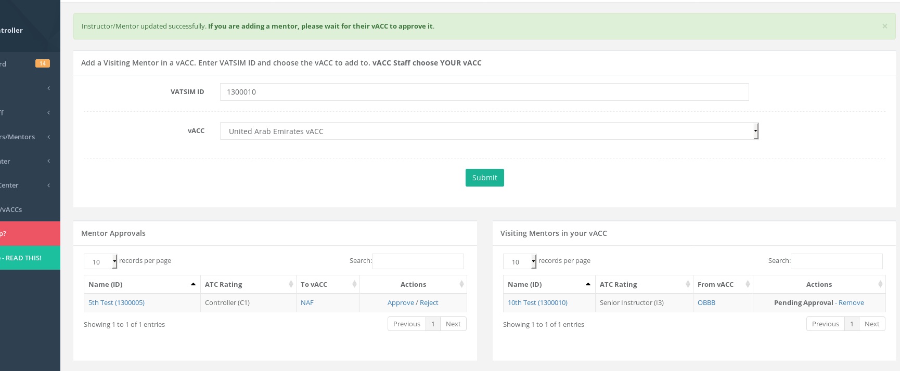

