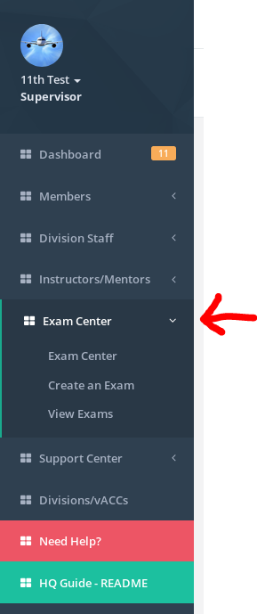
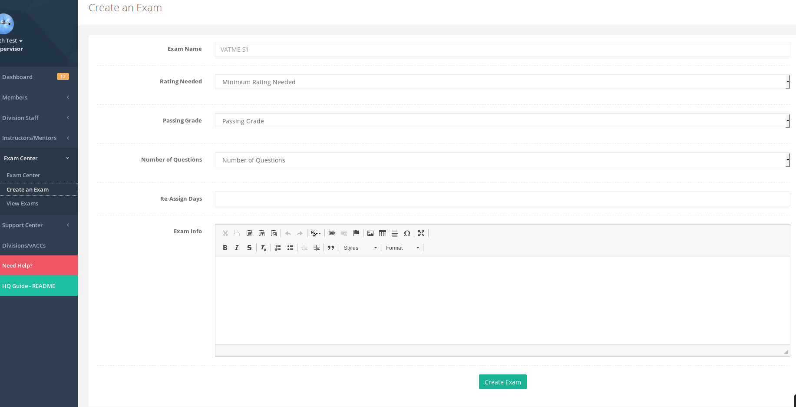
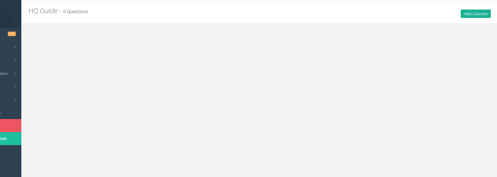
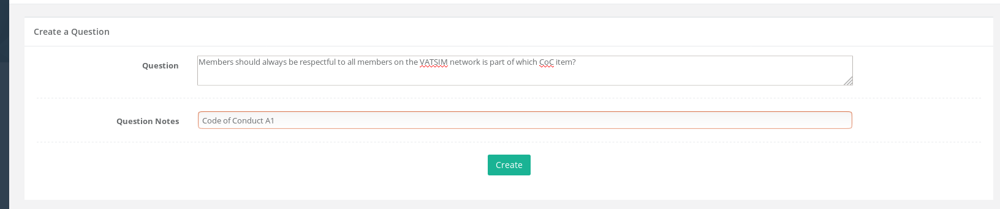
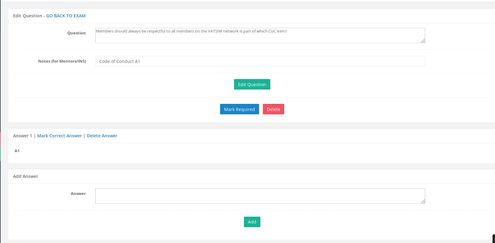
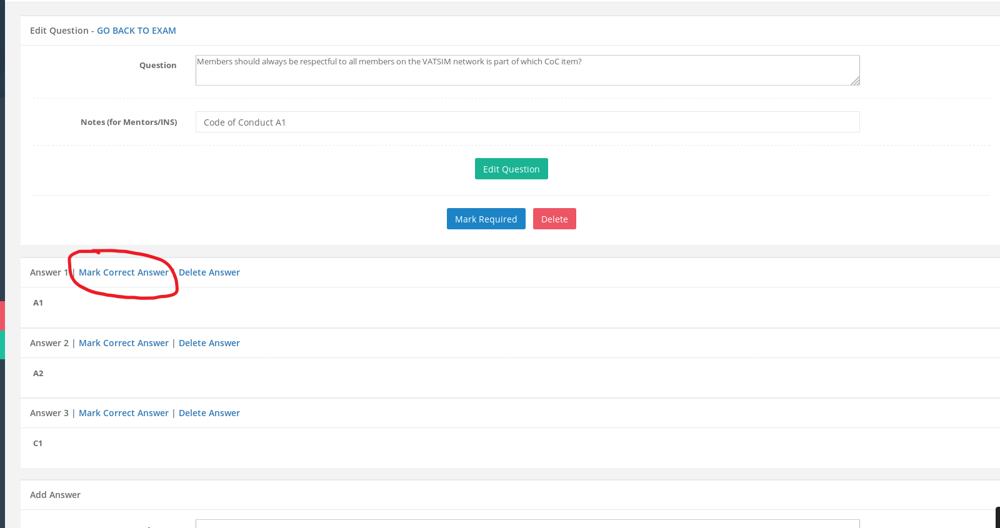
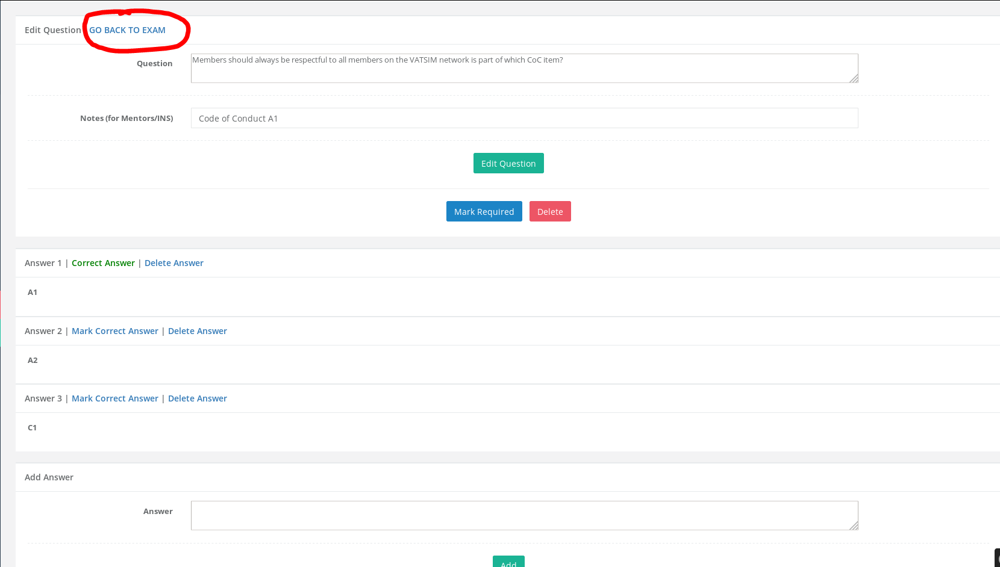

# Exam Center

The exam center allows members to take theoretical exams and also for staff to create/modify theoretical exams.

If you are a training staff \(director/deputy/ATC training director\) of a division/vACC, you are able to create exams for members under your division/vACC. The menu item is called Exam Center and options for creating/viewing exams are within this.

## Create an Exam

Currently only simple multiple choice exams can be created in the HQ system. On the create an exam page, fill out the information as necessary.

**Rating Needed** is the minimum rating the student must hold in order to take this exam.

**Passing Grade** is currently set to 80% as per VATSIM GRP so this option is just a placeholder.

**Number of Questions** is how many questions should the exam have when a student is taking it. If your number of questions is higher than this, then a random number of questions will be taken. For example, if your exam has a total of 50 questions but you set this option to 25...then 25 questions will be randomly chosen from the pool of 50 questions.

**Re-Assign Days** is after how many days should the exam be re-assigned to the student after they have failed. This is done automatically by the HQ system so once a student fails an exam and if it contains a "re-assign days" then it will automatically assign the exam again to the student.

**Exam Info** is information you can provide to the student about the exam. This can include an introduction to the exam or links to what materials they should review before attempting the exam. This is shown to the student before they begin the exam.

## Adding a Question

Once you have created the exam, you will be taken to the questions page for the exam where you will need to add questions. Click on the green "Add a Question" on the top right of the page to add a question. 

On the "Add a Question" page, you can add the question as well as an optional "Question Notes". The notes can be viewed by the mentors who later go over the exam with the student. The student will also be able to see the notes once they have passed the exam. 

Once you create the question, you will be shown the page to add answers to the question. These are multiple choice answers and only one answer can be chosen as correct. On the bottom of the page, you can add "Answers" and no limits on how many answers you can add to a question. 

On this page, there is a blue button on the top marked "Mark Required" which means this question will ALWAYS be part of the exam when being selected randomly.

Once you have added all the answers to the question, you must mark one of the answers by clicking "Mark Correct Answer". Only one answer can be marked as correct. 

Once you are done with this question, you can go back to the exam by clicking "GO BACK TO EXAM" link on the top and then add another question if necessary. 

**ALWAYS REMEMBER YOU HAVE ATLEAST ONE ANSWER SELECTED ON THE QUESTION. DOUBLE CHECK BEFORE FINISHING!**

