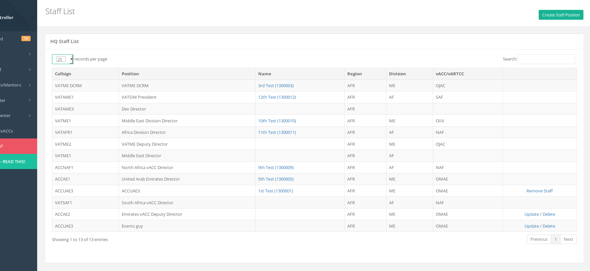
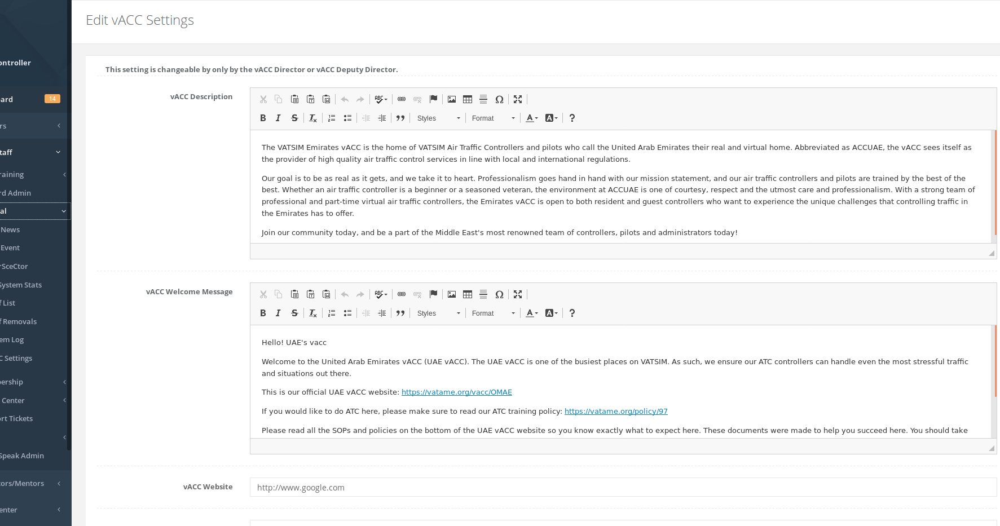

# General

## Add News

Any vACC staff can add a news item for their vACC. Once the news is submitted, it can be edited by clicking the top left green "Edit News" button or the news item can be deleted by clicking the top right red "Delete News" button.

## Add Event

Any vACC staff can add a vACC event. This should normally be done by the vACC events/marketing team after coordination with their staff and/or members.

The **Link to Event** is an external link to the event page that you may have. This is optional as there is also a public HQ event link that will be given for members to view the event.

The **Banner Link** should be a direct link to the image of the banner and sized as mentioned on the form \(width x height\).

The **vACCs** should be added if there are multiple vACCs participating in the event. For example, if UAE vACC is creating the event and the participating vACCs are Jordan, UAE, and North Africa vACCs, then the **vACCs** section of the form should only contain "Jordan" and "North Africa". \(UAE will be automatically added\). **If multiple vACCs are participating, only ONE of the vACCs needs to add the event**.

Below the form it will lists the events that have been added and events can be deleted from there.

## CharSceCtor

Any vACC staff can add CharSceCtor \(Charts, Sceneries, Sector Files, and Miscellaneous\). These should be direct links to the relevant documents/files. This will appear on the HQ vACC page as well as any websites that use the CharSceCtor API methods.

## HQ System Stats

This page lists HQ stats viewable by any staff member.

## Staff List

This page is a link to the HQ staff page listing all the staff members in the HQ system. If you are the vACC Director, then for staff in your vACC you will be able to Create/Delete/Remove/Update the staff.

Create a new staff position by clicking the top right green "Create Staff Position" button.

Update will allow you to update the position including adding a member to that staff. The new staff member will receive an email automatically once they have been appointed.

Remove Staff will be available once a member is appointed. If removing a staff member from your vACC, it will ask to provide a reason for the removal. The staff member will automatically receive an email once they have been removed.

Delete is available if the staff role is not assigned to any member and can be deleted.

## Staff Removals

Staff that have been removed in your vACC will be listed here including their reasons for removal and when they were removed.

## System Log

The HQ system log lists all the actions that have been performed on the system. This is useful for audit purposes and to see when a certain action was done. Any vACC staff can view the system log and the data is shown for their division only.

## vACC Settings

Settings for the vACC are listed here. These include settings such as vACC description, welcome messages, etc. Most settings are editable only by the vACC director or deputy director on the top form.

* **vACC Description** is a description for the vACC and what members can see when they go to the vACC page on the HQ.
* **vACC Welcome Message** is a message resident members see when they first choose to join your vACC. This can also be viewed again on the HQ vACC page.
* **vACC Website** should be added if your vACC has its own website. Please make sure to include the full website address including the http://...
* **Exam Re-Assign \(Days\)** is used for theory exam reassignments when a student has failed their theory exam and the specific exam does not have its own "re-assign" value.
* **Obs Requests** stands for "observation requests" module on the HQ system. This allows ATC members in your vACC to post video links of them controlling online and then your vACC mentors/instructors can review those videos to understand how a member is progressing over time.
* **ATC Sign Off** is used by some vACCs for training purposes with the above Obs Requests module. This allows vACCs to manage their members' training and "sign off" the member on a position once they have shown proficiency in it.
* **Mentor/INS Add Time** allows mentors and instructors in your vACC to be able to post their own times on the HQ so that students can choose them. Some vACCs would like to restrict this and as such it is its own option. This first option is for ALL RATINGS \(no restrictions\).
* **Mentor/INS Add Time \(OBS\)** allows the same function as the one above but only restricts mentors to post times for OBS-rated members so that only those members rated OBS can choose a mentor's availability time. This gives priority to those OBS rated members in your vACC to be able to start controlling.
* **ATC Feedback** enables the ATC feedback for your vACC so that VATSIM members can log into the HQ system to leave feedback for your controllers and allow staff members in your vACC to review them.

The bottom form is editable by any vACC staff and that is the vACC banner image. This is the homepage image of the vACC and should be a direct image link. Prior coordination should be done with your vACC staff before changing this image!

 

