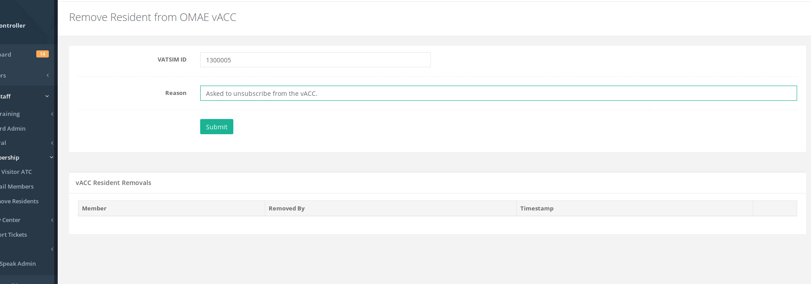

# Membership

## Add Visitor ATC

This page allows you to add a visitor controller to your vACC. Only add the VATSIM ID of the visitor controller - the member only needs to be a member of VATSIM. Only the vACC director, deputy, or ATC training directors can add/remove visitor ATC.

Once they are added, you will need to ask the member to log out of the HQ system \(using the top right Log Out\) and log back into HQ to refresh their status. 

You can also navigate to your vACC page \(on the left menu, click **Divisions/vACCs** and then choose your vACC\) to find which visiting members have not logged into HQ yet. Scroll down to the ATC roster section and any member with a yellow PENDING label means they have not logged into HQ yet. 

## E-mail Members

The vACC staff have the ability to mass email their members based on a variety of conditions. There are multiple "Groups" on which you can email. This can be just residents, visitors, residents AND visitors, etc.

**The Position approved groups should be used with caution so that you do not send multiple emails.**  For example, if you wish to send emails to ALL DEP/APP approved members in your vACC, choose the group "\[vACC\] DEP/APP Approved ATC". This will send the email to any member on your vACC roster who has been approved "DEL,GND,TWR,DEP,APP" or "DEL,GND,TWR,DEP,APP,CTR". The CTR is included since they are also approved for DEP/APP.

## Remove Residents

This page allows you to remove a resident member from the vACC. Only the vACC director, deputy director, or membership directors can remove resident members.

This function is useful if a member requests to no longer want to receive mass emails from the vACC but is not changing their division.

