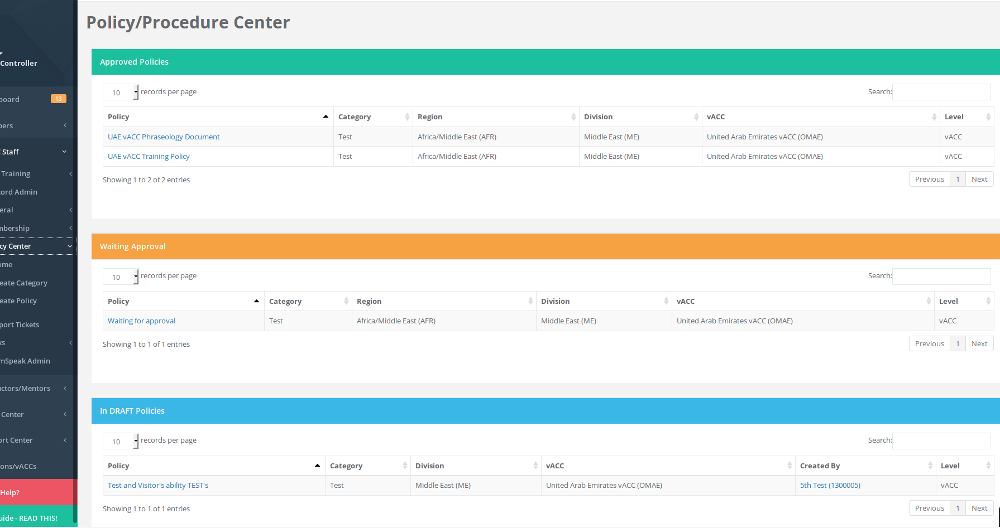
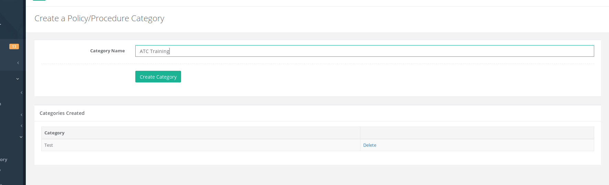
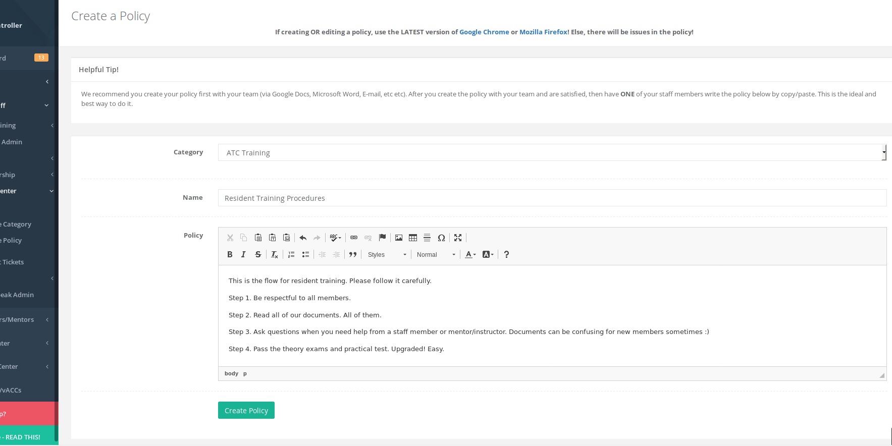
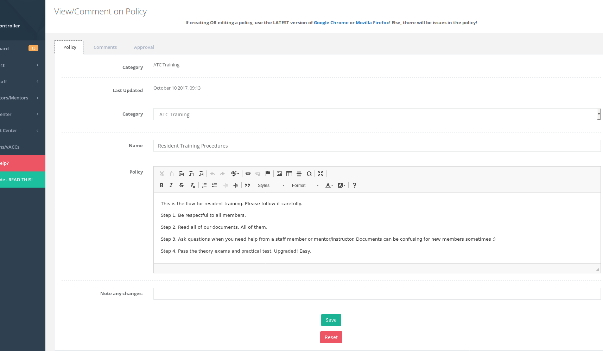
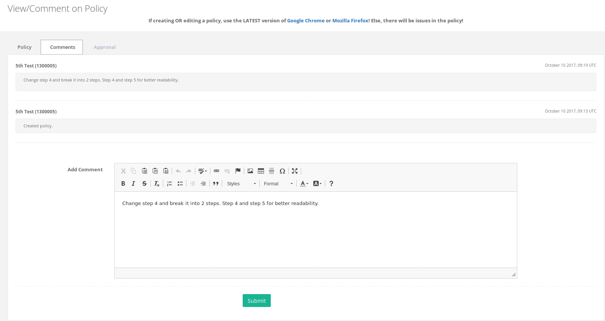
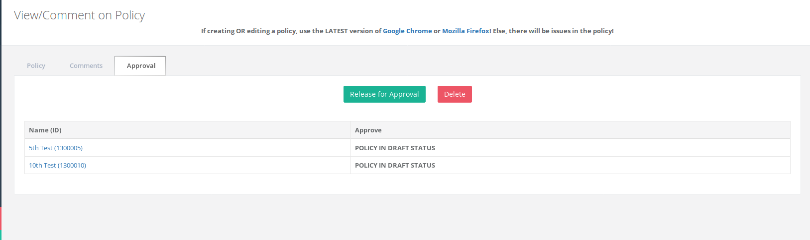
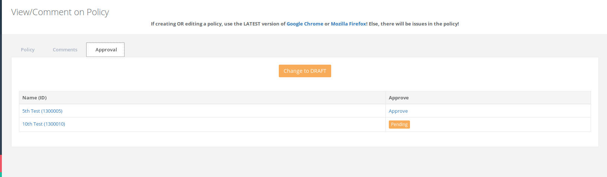
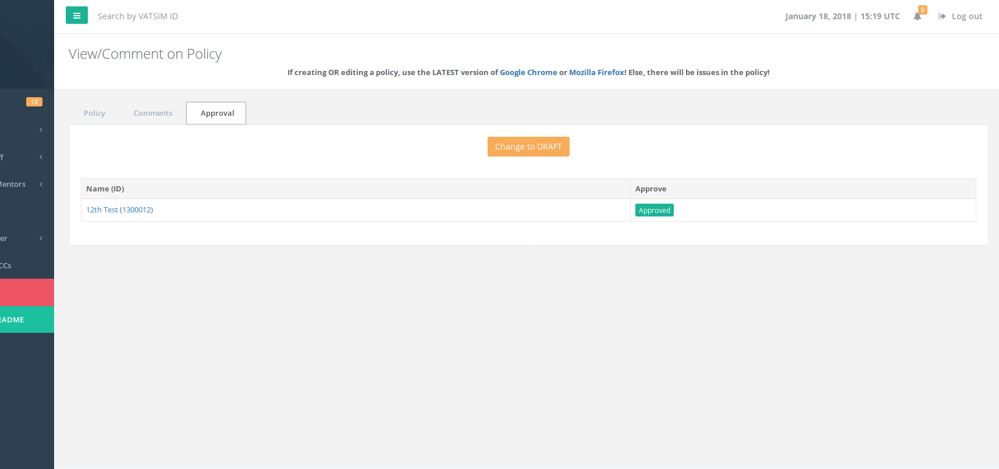
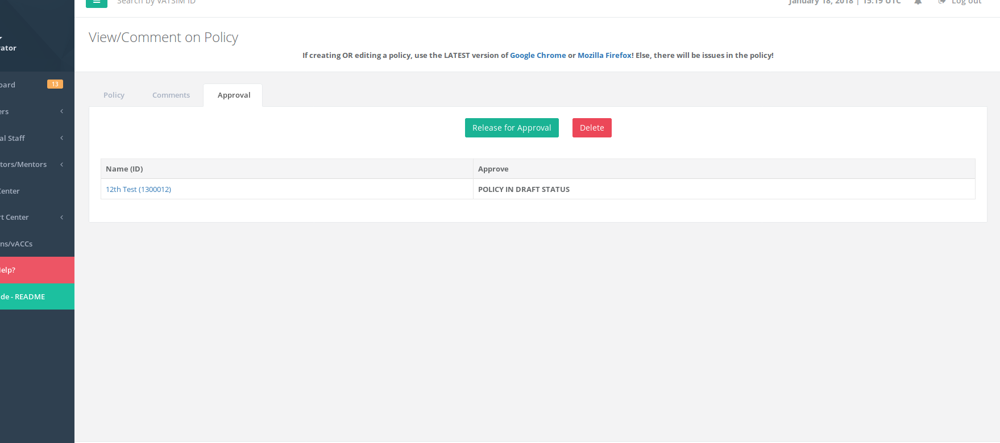

# Policy Center

The policy/procedure center allows staff members to create policies or procedure documents for their vACC, division, or region. The "Home" page shows all the policies in your relevant area that are approved, waiting to be approved, or in draft status. Any staff member can create a policy/procedure document.

**If you are a vACC staff**, then you will only be able to view policies/procedures created in your vACC.

**If you are a division staff**, then you will be able to view policies/procedures created by your division staff or any of the vACCs under your division.

**If you are a regional staff**, then you will be able to view the same as division staff but for all divisions under your region.

## Create Category

To start a policy, a category must be created if there is not one available. Example: if you are creating a policy regarding ATC Progression, then you can create a category "ATC Training".

On the bottom table, you can see which categories have been created and delete one if it is no longer used. Only categories that are not assigned to any policies can be deleted.

## Create Policy

Once the category is created, you can create the policy. Before creating the policy, you should work with your staff members on the document and finalize it as best as possible. You can use tools such as Google Docs to work collaboratively. In the HQ system, the document can be worked on by one person only. If multiple staff are creating or updating the policy document, it will be overwritten by the last member.

Once the policy is created, you will have additional tabs available: **Comments** and **Approval**.

When editing a policy, it will require to enter "Note any changes". The text will be submitted as a comment on the comments tab. Once an edit is submitted, a notification is sent to your staff team notifying them that this policy was updated by you.

The red **RESET** button will reset the text editor to blank. Only use this to start the policy again from blank! 

The comments tab allows staff members to view and leave comments on the policy. 

The approvals tab will show which staff members will need to approve this policy once it is released for approval. Any policy created by the vACC will require that the vACC director and the division director to approve it. Any policy created by the division, will require the division director and region director to approve. Any policy created by the region will only require region director approval.

A policy can be deleted from the Approval tab if it has not been "Released for Approval" by clicking the red "Delete" button. 

If a policy is "Release for Approval" the approvers listed on the table will receive an email asking them to view this policy and approve it. Once it is released for approval, you will not be able to edit the policy until it has been approved or one of the approvers changes the status to DRAFT. 

Once a policy is approved, the staff team that created the policy will receive an email.

## Editing a Policy

All approved policies can be viewed on the Policy Center &gt; Home page. You can edit any policy that you are in charge of or created. Any changes will require you to add a note and a notification will be sent out to your entire staff team \(ex: if you are a vACC staff, your whole vACC staff will receive the notification\).

## Deleting a Policy

In order to delete a policy, you must be the director of that relevant policy area \(ex: if it is a vACC policy, you must be the vACC director\).

To delete, go to the Policy Center &gt; Home page. Find the policy you wish to delete and view the policy. Go to the "Approvals" tab and it must first be changed to DRAFT mode.

Once the policy is in DRAFT mode, you can go back to the Approval tab and be able to delete the policy.

