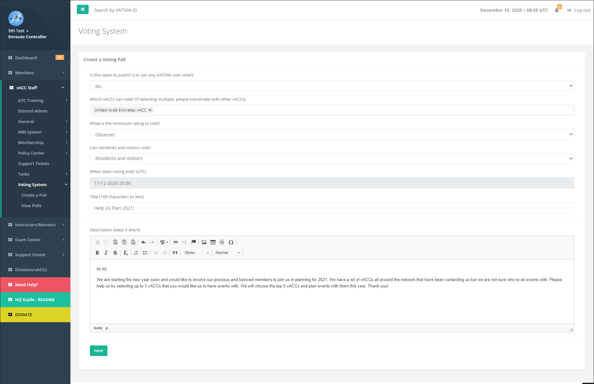
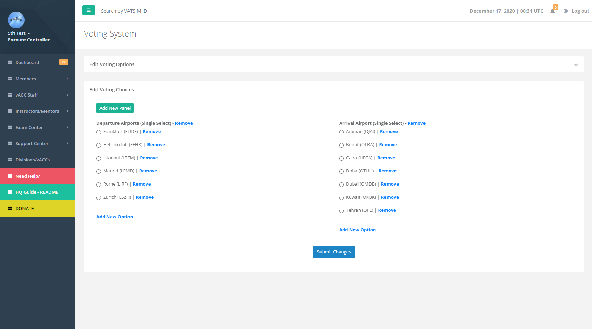
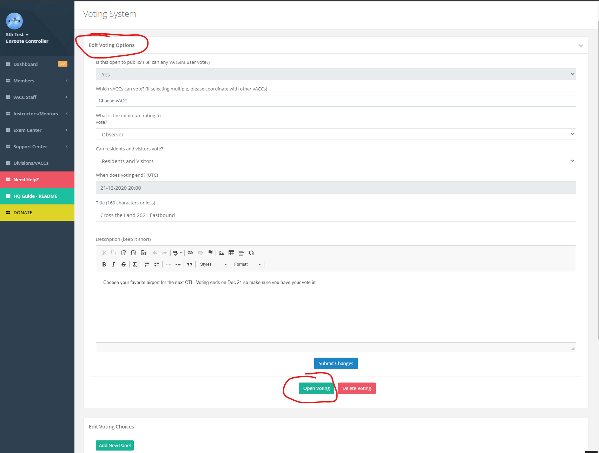

# Voting System

## Create a Poll

Only the vACC staff or division staff can create a poll. They can allow only certain vACCs to vote or allow it publicly. Note, that allowing publicly allows any VATSIM member to vote since any member on VATSIM can log into the HQ System. 

The poll can be targeted towards residents or visitor controllers. Furthermore, the poll can be restricted to a minimum rating in case the staff is gauging for feedback on particular topics.

Once a poll is created, the next step is for the staff to add the options. The voting system allows adding multiple "panels" for voting. This can be useful in cases such as if the staff wants to do a "CTP" sort of event where there can be Arrival and Departure airports. 

Once the voting options have been entered, click on Submit Changes to save the options. Once submitted, click the top Edit Voting Options and remember to OPEN VOTING in order to allow members to vote. 

